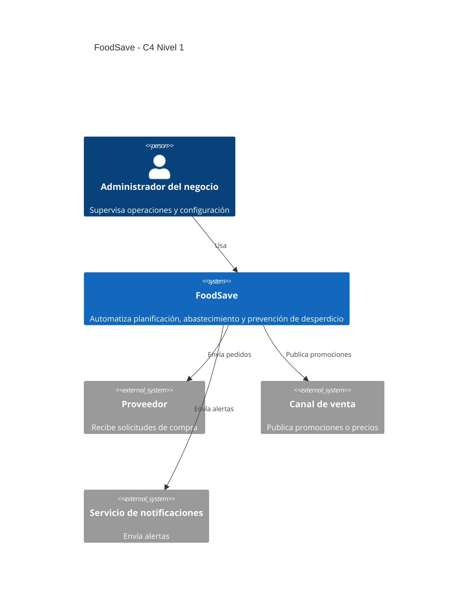
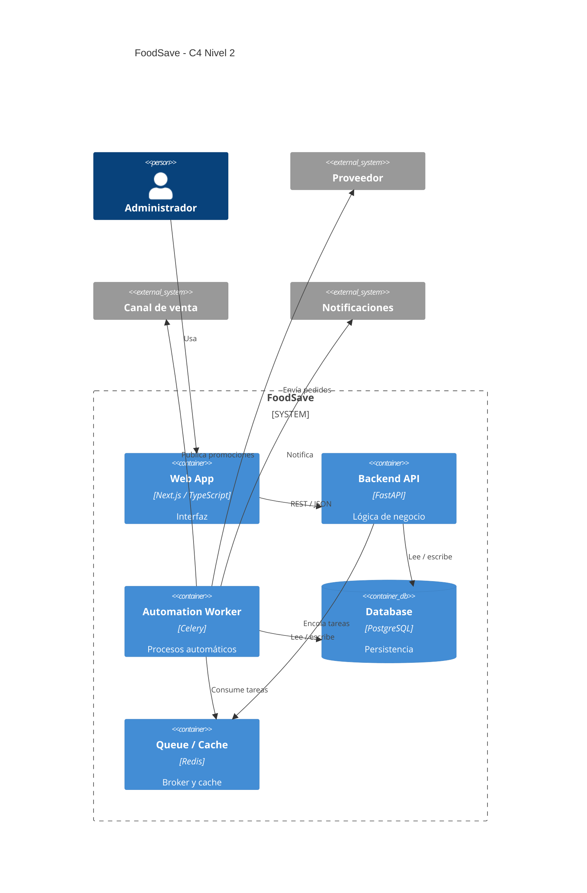
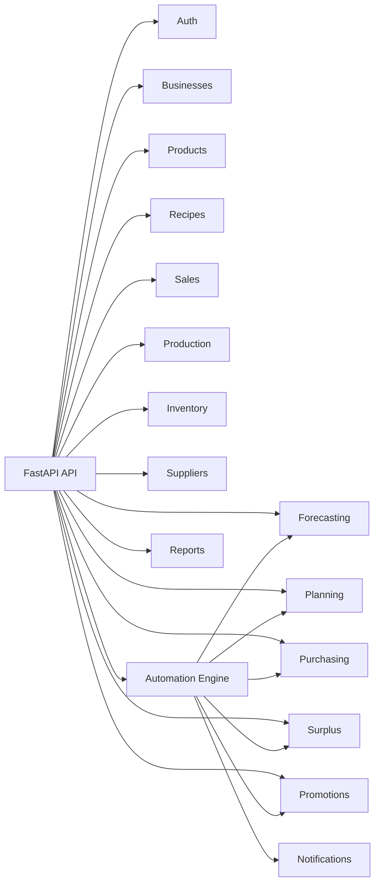
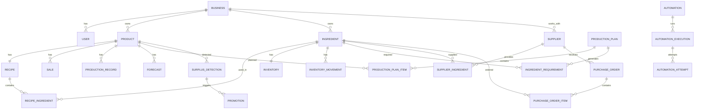

# FoodSave — Documento Técnico Maestro

## 1. Propósito

Este documento define la estructura técnica, funcional y organizacional de **FoodSave**. Debe servir como referencia para arquitectura, desarrollo, integración, documentación, testing y división del trabajo.

Equipo:
- Axel Cueva
- Edu Sanchez
- Kevin Bohorquez
- Leonardo Vera
- Leonardo Aguirre
- Max Rojas

## 2. Definición del proyecto

**FoodSave es una plataforma SaaS de automatización preventiva para negocios que producen y comercializan alimentos perecibles.**

Analiza ventas, producción, inventario, recetas, insumos, proveedores, excedentes y desperdicio para:
- predecir demanda;
- generar planes de producción;
- calcular necesidades de insumos;
- detectar faltantes;
- generar y enviar pedidos;
- seleccionar proveedores;
- detectar excedentes;
- activar promociones;
- verificar resultados;
- reintentar ante fallos;
- notificar incidencias;
- registrar resultados;
- alimentar reportes y métricas.

Ciclo principal:

```text
DETECTAR
↓
DECIDIR
↓
ACTUAR
↓
VERIFICAR
↓
CORREGIR / REINTENTAR
↓
NOTIFICAR
↓
REGISTRAR RESULTADO
```

## 3. Flujo funcional principal

```text
Ventas históricas
↓
Predicción de demanda
↓
Plan de producción
↓
Cálculo de ingredientes
↓
Detección de faltantes
↓
Generación de pedidos
↓
Envío a proveedores
↓
Verificación del envío
↓
Producción
↓
Ventas durante el día
↓
Detección de excedentes
↓
Promoción automática
↓
Verificación del efecto
↓
Registro del resultado
↓
Dashboard y reportes
```

## 4. Alcance

FoodSave se centra en:
- planificación;
- automatización;
- abastecimiento;
- prevención de desperdicio;
- control;
- trazabilidad;
- seguimiento de resultados.

No debe convertirse en:
- ERP completo;
- POS completo;
- sistema contable;
- facturación electrónica;
- CRM;
- recursos humanos;
- delivery;
- ecommerce completo;
- sistema de pagos.

Estas áreas pueden existir como integraciones externas.


# 5. Arquitectura

## 5.1 Decisión arquitectónica

Se propone un **monolito modular con procesamiento asíncrono para automatizaciones**.

Ventajas:
- módulos funcionales bien delimitados;
- menor complejidad operativa;
- despliegue sencillo;
- integración directa entre dominios;
- posibilidad de trabajar en paralelo;
- posibilidad futura de extraer servicios.

## 5.2 Stack tecnológico

### Frontend
- Next.js
- TypeScript
- Tailwind CSS
- shadcn/ui
- Recharts
- TanStack Query
- React Hook Form
- Zod

### Backend
- Python
- FastAPI
- Pydantic
- SQLAlchemy
- Alembic

### Persistencia
- PostgreSQL

### Automatización
- Celery
- Redis
- Celery Beat

### Datos / predicción
- Pandas
- NumPy
- scikit-learn

### Seguridad
- JWT
- bcrypt / passlib

### Testing
- Pytest
- Playwright
- Vitest / React Testing Library opcional

### Infraestructura
- Docker
- Docker Compose

### CI/CD
- GitHub Actions

### Diseño y documentación
- Figma
- OpenAPI / Swagger
- Markdown
- Mermaid

## 5.3 Arquitectura general

```text
┌──────────────────────────────────────────────────┐
│                    FRONTEND                      │
│               Next.js + TypeScript               │
│                                                  │
│ Dashboard                                        │
│ Producción                                       │
│ Inventario                                       │
│ Compras                                          │
│ Proveedores                                      │
│ Excedentes                                       │
│ Promociones                                      │
│ Automatizaciones                                 │
│ Reportes                                         │
│ Configuración                                    │
└───────────────────────┬──────────────────────────┘
                        │ REST / JSON
                        ▼
┌──────────────────────────────────────────────────┐
│                     BACKEND                      │
│                     FastAPI                      │
│                                                  │
│ Auth / Business                                  │
│ Products / Recipes                               │
│ Sales / Production                               │
│ Inventory                                        │
│ Forecasting                                      │
│ Planning                                         │
│ Suppliers                                        │
│ Purchasing                                       │
│ Surplus                                          │
│ Promotions                                      │
│ Automations                                     │
│ Reports                                          │
└───────────────┬──────────────────────┬───────────┘
                │                      │
                ▼                      ▼
          PostgreSQL                 Redis
                                         │
                                         ▼
                                  Celery Workers
                                         │
                     ┌───────────────────┼──────────────────┐
                     ▼                   ▼                  ▼
                Forecasting         Purchasing          Surplus /
                                                       Promotions
                                         │
                                         ▼
                                  Control / Retries
                                         │
                                         ▼
                               Logs / Notifications
```


# 6. C4

## 6.1 Nivel 1 — Contexto



## 6.2 Nivel 2 — Contenedores



## 6.3 Nivel 3 — Componentes principales




# 7. Módulos funcionales

## 7.1 Auth
Responsabilidades:
- login;
- refresh token;
- protección de endpoints;
- roles.

Entidades:
- User
- Role

Roles iniciales:
- ADMIN
- OPERATOR

## 7.2 Businesses
Entidad:
- Business

Campos sugeridos:
- id
- name
- timezone
- opening_time
- closing_time
- currency
- created_at
- updated_at

## 7.3 Products
Entidad:
- Product

Campos:
- id
- business_id
- name
- category
- sale_price
- estimated_cost
- active
- created_at
- updated_at

Funcionalidades:
- crear;
- editar;
- consultar;
- listar;
- filtrar;
- desactivar.

## 7.4 Recipes
Entidades:
- Ingredient
- Recipe
- RecipeIngredient

Ejemplo:
```text
Empanada de pollo
100 g pollo
80 g harina
30 g cebolla
```

Funcionalidades:
- registrar ingredientes;
- crear receta;
- editar receta;
- asociar ingredientes;
- definir cantidad por unidad.

## 7.5 Sales
Entidad:
- Sale

Campos:
- id
- business_id
- product_id
- quantity
- unit_price
- total
- sale_date
- sale_time
- source
- created_at

Funcionalidades:
- registrar venta;
- consultar histórico;
- filtrar por fecha;
- filtrar por producto;
- importar CSV;
- agrupar ventas.

## 7.6 Production
Entidad:
- ProductionRecord

Campos:
- id
- product_id
- date
- planned_quantity
- produced_quantity
- created_at

Funcionalidades:
- registrar producción;
- actualizar cantidad;
- comparar plan vs producido;
- consultar historial.

## 7.7 Inventory
Entidades:
- Inventory
- InventoryMovement

Inventory:
- id
- ingredient_id
- current_stock
- unit
- minimum_stock
- updated_at

InventoryMovement:
- id
- ingredient_id
- type
- quantity
- reason
- created_at

Tipos:
- IN
- OUT
- ADJUSTMENT
- PRODUCTION
- WASTE

Funcionalidades:
- consultar stock;
- registrar entrada;
- registrar salida;
- ajustar;
- detectar bajo stock;
- consultar movimientos.


## 7.8 Forecasting

Responsabilidad:
- estimar demanda futura.

Entradas:
- ventas históricas;
- producto;
- día de semana;
- tendencia reciente.

Variables futuras:
- feriados;
- clima;
- promociones;
- temporada;
- eventos.

Entidad:
- Forecast

Campos:
- id
- product_id
- forecast_date
- predicted_quantity
- confidence
- model_name
- model_version
- created_at

Método base:
```text
Promedio histórico por día de semana
+
media móvil
```

Métodos futuros:
- Random Forest
- Gradient Boosting
- XGBoost

## 7.9 Planning

Fórmula conceptual:

```text
Producción recomendada =
demanda prevista
-
stock producto terminado
+
margen de seguridad
```

Entidades:
- ProductionPlan
- ProductionPlanItem
- IngredientRequirement

ProductionPlan:
- id
- business_id
- plan_date
- status
- created_at

ProductionPlanItem:
- id
- production_plan_id
- product_id
- forecast_quantity
- stock_quantity
- safety_quantity
- recommended_quantity

IngredientRequirement:
- id
- production_plan_id
- ingredient_id
- required_quantity
- available_quantity
- shortage_quantity

## 7.10 Suppliers

Entidades:
- Supplier
- SupplierIngredient

Supplier:
- id
- business_id
- name
- email
- phone
- preferred_contact_method
- active
- created_at

SupplierIngredient:
- supplier_id
- ingredient_id
- unit_price
- minimum_order
- estimated_delivery_time
- preferred

Funcionalidades:
- crear;
- actualizar;
- desactivar;
- asociar insumos;
- marcar proveedor habitual;
- registrar precio.

## 7.11 Purchasing

Flujo:
```text
IngredientRequirement
↓
shortage > 0
↓
buscar proveedor
↓
agrupar productos
↓
crear pedido
↓
enviar
↓
verificar
```

Entidades:
- PurchaseOrder
- PurchaseOrderItem

Estados:
- GENERATED
- PENDING
- SENDING
- SENT
- CONFIRMED
- RETRYING
- FAILED
- CANCELLED

## 7.12 Surplus

Cálculo conceptual:
```text
stock_restante = producido - vendido

excedente_estimado =
stock_restante - ventas_estimadas_hasta_cierre
```

Entidad:
- SurplusDetection

Campos:
- id
- product_id
- detected_at
- current_stock
- expected_remaining_sales
- expected_surplus
- risk_level
- status

Riesgo:
- LOW
- MEDIUM
- HIGH
- CRITICAL

## 7.13 Promotions

Entidad:
- Promotion

Campos:
- id
- product_id
- surplus_detection_id
- discount_percentage
- start_at
- end_at
- status
- created_at

Estados:
- SCHEDULED
- ACTIVE
- FINISHED
- CANCELLED
- FAILED

Regla ejemplo:
```text
IF risk_level = HIGH
AND time_to_close <= 90 min
THEN discount = 10%
```


# 8. Automatización y control

## 8.1 Automation

Campos:
- id
- business_id
- type
- name
- enabled
- schedule
- max_retries
- configuration
- created_at
- updated_at

Tipos:
- DAILY_PLANNING
- SUPPLIER_ORDER
- SURPLUS_MONITORING
- PROMOTION_ACTIVATION
- PROMOTION_MONITORING

## 8.2 AutomationExecution

Campos:
- id
- automation_id
- status
- started_at
- finished_at
- input_data
- output_data
- error_message
- retry_count

Estados:
- PENDING
- RUNNING
- VERIFYING
- COMPLETED
- RETRYING
- FAILED
- CANCELLED

## 8.3 AutomationAttempt

Campos:
- id
- automation_execution_id
- attempt_number
- started_at
- finished_at
- status
- error_message

## 8.4 Patrón de control

```text
execute()
↓
verify()
↓
¿correcto?

YES
↓
COMPLETED

NO
↓
¿quedan reintentos?

YES
↓
RETRYING
↓
execute()

NO
↓
FAILED
↓
notify()
```

## 8.5 Automatización — Planificación diaria

Disparador:
```text
22:00 todos los días
```

Flujo:
```text
leer ventas
↓
validar información
↓
generar forecast
↓
generar plan
↓
calcular ingredientes
↓
consultar inventario
↓
generar faltantes
↓
guardar resultado
```

Control:
```text
¿Plan generado correctamente?
NO → reintentar
nuevo fallo → registrar error → notificar
```

## 8.6 Automatización — Abastecimiento

```text
shortage > 0
↓
buscar proveedor
↓
agrupar necesidades
↓
crear pedido
↓
enviar
↓
verificar envío
```

Control:
```text
envío no confirmado
↓
reintentar
↓
si vuelve a fallar
FAILED
↓
notificar
```

## 8.7 Automatización — Control de excedentes

Disparador:
```text
cada 30 minutos
```

Flujo:
```text
leer producción
↓
leer ventas
↓
calcular stock restante
↓
predecir venta restante
↓
calcular excedente
↓
calcular riesgo
```

## 8.8 Automatización — Promoción preventiva

```text
riesgo detectado
↓
seleccionar estrategia
↓
calcular descuento
↓
crear promoción
↓
publicar
↓
verificar publicación
```

## 8.9 Automatización — Control de promoción

```text
esperar intervalo
↓
leer ventas nuevas
↓
recalcular excedente
↓
¿riesgo disminuyó?
```

Si sí:
```text
mantener / finalizar
```

Si no:
```text
recalcular acción
↓
ejecutar nueva promoción
```


# 9. Notifications

Entidad:
- Notification

Campos:
- id
- user_id
- type
- title
- message
- read
- created_at

Canales iniciales:
- notificación interna;
- email.

Posibles integraciones:
- WhatsApp;
- Slack;
- push.

# 10. Reports

Métricas:

## Operación
- producción;
- ventas;
- excedentes;
- stock;
- pedidos.

## Predicción
- MAE;
- MAPE;
- precisión aproximada.

## Automatización
- ejecuciones;
- completadas;
- fallidas;
- reintentos;
- tiempo promedio.

## Impacto económico
- pérdida potencial;
- pérdida evitada;
- costo de desperdicio.

## Desperdicio
- unidades desperdiciadas;
- unidades recuperadas;
- kg desperdiciados;
- kg evitados.


# 11. Modelo conceptual de datos




# 12. API propuesta

Base:
```text
/api/v1
```

## Auth
```http
POST /auth/login
POST /auth/refresh
GET  /auth/me
```

## Businesses
```http
GET   /businesses/current
PATCH /businesses/current
```

## Products
```http
GET    /products
GET    /products/{id}
POST   /products
PUT    /products/{id}
DELETE /products/{id}
```

## Ingredients
```http
GET    /ingredients
GET    /ingredients/{id}
POST   /ingredients
PUT    /ingredients/{id}
DELETE /ingredients/{id}
```

## Recipes
```http
GET  /products/{product_id}/recipe
POST /products/{product_id}/recipe
PUT  /products/{product_id}/recipe
```

## Sales
```http
GET  /sales
POST /sales
POST /sales/import
GET  /sales/summary
```

## Production
```http
GET  /production
POST /production
PUT  /production/{id}
```

## Inventory
```http
GET  /inventory
GET  /inventory/{ingredient_id}
POST /inventory/movements
GET  /inventory/movements
GET  /inventory/low-stock
```

## Forecasting
```http
GET  /forecasts
GET  /forecasts/{date}
POST /forecasts/run
```

## Planning
```http
GET  /plans
GET  /plans/{id}
POST /plans/generate
GET  /plans/{id}/ingredients
```

## Suppliers
```http
GET    /suppliers
GET    /suppliers/{id}
POST   /suppliers
PUT    /suppliers/{id}
DELETE /suppliers/{id}
POST   /suppliers/{id}/ingredients
```

## Purchasing
```http
GET  /purchase-orders
GET  /purchase-orders/{id}
POST /purchase-orders/generate
POST /purchase-orders/{id}/send
POST /purchase-orders/{id}/retry
```

## Surplus
```http
GET  /surplus
GET  /surplus/current
POST /surplus/run
```

## Promotions
```http
GET  /promotions
GET  /promotions/{id}
POST /promotions/generate
POST /promotions/{id}/activate
POST /promotions/{id}/stop
```

## Automations
```http
GET  /automations
GET  /automations/{id}
PUT  /automations/{id}
GET  /automation-executions
GET  /automation-executions/{id}
POST /automations/{id}/run
POST /automation-executions/{id}/retry
```

## Reports
```http
GET /reports/dashboard
GET /reports/operations
GET /reports/waste
GET /reports/forecasting
GET /reports/automations
```


# 13. Estructura propuesta del repositorio

```text
foodsave/
│
├── README.md
├── .gitignore
├── .env.example
├── docker-compose.yml
├── Makefile
│
├── docs/
│   ├── architecture/
│   │   ├── overview.md
│   │   ├── decisions/
│   │   │   ├── ADR-001-modular-monolith.md
│   │   │   ├── ADR-002-fastapi.md
│   │   │   ├── ADR-003-postgresql.md
│   │   │   └── ADR-004-celery-redis.md
│   │   ├── c4/
│   │   │   ├── context.md
│   │   │   ├── containers.md
│   │   │   └── components.md
│   │   └── diagrams/
│   │
│   ├── api/
│   │   ├── contracts.md
│   │   └── endpoints.md
│   │
│   ├── database/
│   │   ├── erd.md
│   │   └── data_dictionary.md
│   │
│   ├── automation/
│   │   ├── flows.md
│   │   ├── retry-policy.md
│   │   └── scheduling.md
│   │
│   └── team/
│       ├── responsibilities.md
│       └── git-workflow.md
│
├── frontend/
│   ├── package.json
│   ├── next.config.ts
│   ├── tsconfig.json
│   ├── tailwind.config.ts
│   ├── Dockerfile
│   ├── public/
│   └── src/
│       ├── app/
│       │   ├── layout.tsx
│       │   ├── page.tsx
│       │   ├── login/
│       │   ├── dashboard/
│       │   ├── products/
│       │   ├── production/
│       │   ├── inventory/
│       │   ├── purchases/
│       │   ├── suppliers/
│       │   ├── surplus/
│       │   ├── promotions/
│       │   ├── automations/
│       │   ├── reports/
│       │   └── settings/
│       │
│       ├── components/
│       │   ├── ui/
│       │   ├── layout/
│       │   │   ├── Sidebar.tsx
│       │   │   ├── Header.tsx
│       │   │   └── AppShell.tsx
│       │   ├── dashboard/
│       │   ├── charts/
│       │   ├── tables/
│       │   ├── automation/
│       │   └── forms/
│       │
│       ├── features/
│       │   ├── products/
│       │   ├── sales/
│       │   ├── production/
│       │   ├── inventory/
│       │   ├── planning/
│       │   ├── suppliers/
│       │   ├── purchasing/
│       │   ├── surplus/
│       │   ├── promotions/
│       │   └── automations/
│       │
│       ├── services/
│       │   ├── api-client.ts
│       │   ├── products.ts
│       │   ├── sales.ts
│       │   ├── inventory.ts
│       │   ├── planning.ts
│       │   ├── purchasing.ts
│       │   └── automations.ts
│       ├── hooks/
│       ├── types/
│       ├── utils/
│       └── constants/
│
├── backend/
│   ├── pyproject.toml
│   ├── alembic.ini
│   ├── Dockerfile
│   ├── migrations/
│   ├── tests/
│   │   ├── unit/
│   │   ├── integration/
│   │   └── fixtures/
│   └── app/
│       ├── main.py
│       ├── core/
│       │   ├── config.py
│       │   ├── database.py
│       │   ├── security.py
│       │   ├── exceptions.py
│       │   ├── logging.py
│       │   └── dependencies.py
│       ├── shared/
│       │   ├── enums/
│       │   ├── schemas/
│       │   ├── utils/
│       │   └── events/
│       ├── modules/
│       │   ├── auth/
│       │   ├── businesses/
│       │   ├── products/
│       │   ├── recipes/
│       │   ├── sales/
│       │   ├── production/
│       │   ├── inventory/
│       │   ├── forecasting/
│       │   ├── planning/
│       │   ├── suppliers/
│       │   ├── purchasing/
│       │   ├── surplus/
│       │   ├── promotions/
│       │   ├── automations/
│       │   ├── notifications/
│       │   └── reports/
│       ├── workers/
│       │   ├── celery_app.py
│       │   ├── scheduler.py
│       │   ├── tasks/
│       │   │   ├── forecasting.py
│       │   │   ├── planning.py
│       │   │   ├── purchasing.py
│       │   │   ├── surplus.py
│       │   │   ├── promotions.py
│       │   │   └── notifications.py
│       │   └── retry/
│       │       ├── policy.py
│       │       └── handler.py
│       └── integrations/
│           ├── suppliers/
│           ├── notifications/
│           └── sales_channels/
│
├── scripts/
│   ├── seed.py
│   ├── reset_db.py
│   └── create_admin.py
│
└── .github/
    └── workflows/
        ├── backend-ci.yml
        ├── frontend-ci.yml
        └── integration-ci.yml
```


# 14. Estructura interna de cada módulo backend

```text
module/
├── router.py
├── service.py
├── repository.py
├── models.py
├── schemas.py
├── dependencies.py
├── exceptions.py
└── tests/
```

Responsabilidades:

## router.py
- API HTTP;
- validación de parámetros;
- delegación al service.

## service.py
- reglas de negocio;
- coordinación interna.

## repository.py
- persistencia;
- queries.

## models.py
- SQLAlchemy.

## schemas.py
- Pydantic.

## exceptions.py
- errores específicos del dominio.

Regla importante:

```text
Un módulo NO accede directamente al repository de otro módulo.
```

Incorrecto:
```text
Planning → InventoryRepository
```

Correcto:
```text
PlanningService → InventoryService
```


# 15. Contratos entre módulos

## Planning → Forecasting

```python
forecast_service.get_forecast(product_id, date)
```

Respuesta:
```json
{
  "product_id": 1,
  "date": "2026-09-24",
  "predicted_quantity": 60,
  "confidence": 0.93
}
```

## Planning → Inventory

```python
inventory_service.get_stock(ingredient_id)
```

Respuesta:
```json
{
  "ingredient_id": 5,
  "stock": 2,
  "unit": "kg"
}
```

## Planning → Purchasing

```json
{
  "ingredient_id": 5,
  "required": 5.8,
  "available": 2,
  "shortage": 3.8
}
```

## Purchasing → Suppliers

```python
supplier_service.find_preferred_supplier(ingredient_id)
```

## Surplus → Promotions

```json
{
  "product_id": 1,
  "current_stock": 24,
  "expected_sales": 9,
  "expected_surplus": 15,
  "risk": "HIGH"
}
```


# 16. División del equipo

El equipo se organiza en **seis módulos de trabajo integrales**, uno por persona. Cada módulo agrupa los dominios funcionales relacionados que se indican a continuación. **Cada responsable desarrolla el frontend, el backend y las APIs de su módulo**, y entrega su funcionalidad integrada de extremo a extremo.

| Persona | Módulo a cargo | Dominios incluidos |
|---|---|---|
| Axel Cueva | Automatización y control | Automations + Notifications |
| Edu Sanchez | Dashboard y reportes | Dashboard + Reports |
| Kevin Bohorquez | Predicción y planificación | Forecasting + Planning |
| Leonardo Vera | Operación e inventario | Sales + Production + Inventory |
| Leonardo Aguirre | Proveedores y compras | Suppliers + Purchasing |
| Max Rojas | Excedentes, promociones y desperdicio | Surplus + Promotions + Waste |

## Responsabilidades comunes de cada persona

- **Frontend:** desarrollar las pantallas, componentes, formularios y visualizaciones de su módulo, incluyendo validaciones y estados de carga, error y datos vacíos.
- **Backend:** implementar las reglas de negocio, servicios, persistencia, modelos y migraciones correspondientes a su módulo.
- **APIs:** diseñar, implementar y documentar sus endpoints, y conectarlos con su frontend; coordinar los contratos e integraciones con otros módulos.
- **Calidad:** probar el funcionamiento de su módulo y su integración, aplicar los permisos por negocio y documentar su uso.
- **Entrega:** presentar un módulo funcional desde la interfaz hasta la base de datos, incluyendo sus automatizaciones e integraciones cuando correspondan.

## Axel Cueva — Automatización y control

- **Frontend:** pantallas de configuración de automatizaciones, historial y detalle de ejecuciones, intentos, errores, reintentos y notificaciones.
- **Backend:** Automation, AutomationExecution, AutomationAttempt, scheduler, motor de control y reintentos, logs y notificaciones; configuración de Redis, Celery y Celery Beat.
- **APIs:** consulta y configuración de automatizaciones, ejecución manual, seguimiento de ejecuciones, reintentos y gestión de notificaciones.
- **Integración:** orquestar los servicios de los demás módulos mediante los contratos acordados.

## Edu Sanchez — Dashboard y reportes

- **Frontend:** dashboard, reportes, filtros, indicadores, tablas y gráficos.
- **Backend:** servicios de consulta y agregación de datos para métricas operativas, predicción, automatización, impacto económico y desperdicio.
- **APIs:** endpoints de dashboard y reportes, con filtros y respuestas adecuadas para las visualizaciones.
- **Integración:** consumir los datos y servicios de los demás módulos para presentar resultados consolidados.

## Kevin Bohorquez — Predicción y planificación

- **Frontend:** pantallas de pronósticos, métricas de predicción, planes de producción y necesidades de ingredientes.
- **Backend:** preparación de datos, algoritmo de predicción, Forecast, ProductionPlan, ProductionPlanItem, IngredientRequirement y cálculos por receta.
- **APIs:** consulta y ejecución de predicciones, generación y consulta de planes y cálculo de necesidades de ingredientes.
- **Integración:** utilizar ventas, recetas e inventario y entregar los faltantes al módulo de compras; exponer los servicios necesarios para la planificación automática.

## Leonardo Vera — Operación e inventario

- **Frontend:** pantallas de ventas, importación CSV, registro de producción, stock y movimientos de inventario.
- **Backend:** Sales, Production, Inventory, InventoryMovement, importación de ventas, control de stock y stock mínimo.
- **APIs:** registro y consulta de ventas y producción, importación CSV, consulta de inventario y gestión de movimientos.
- **Integración:** proporcionar datos operativos a predicción, planificación, excedentes y reportes.

## Leonardo Aguirre — Proveedores y compras

- **Frontend:** pantallas de proveedores, insumos suministrados, precios, pedidos, detalle de compra y seguimiento de estados y envíos.
- **Backend:** Suppliers, SupplierIngredient, PurchaseOrder, PurchaseOrderItem, selección de proveedor, generación y envío de pedidos y gestión de estados.
- **APIs:** gestión de proveedores y sus insumos, generación y consulta de pedidos, envío y reintento de pedidos.
- **Integración:** recibir faltantes de planificación y conectar el abastecimiento con el motor de automatización.

## Max Rojas — Excedentes, promociones y desperdicio

- **Frontend:** pantallas de excedentes, niveles de riesgo, promociones, seguimiento de resultados y registro de desperdicio.
- **Backend:** SurplusDetection, reglas de excedente, Promotion, activación y seguimiento de promociones, registro de desperdicio y métricas del módulo.
- **APIs:** detección y consulta de excedentes, generación, activación y finalización de promociones y registro y consulta de desperdicio.
- **Integración:** utilizar ventas y producción, conectar las acciones preventivas con automatización y proporcionar resultados a reportes.

## Coordinación de elementos compartidos

- Axel coordina la arquitectura, los contratos, la infraestructura base y la integración general; cada persona implementa y verifica la integración de su propio módulo.
- Edu coordina el AppShell, Sidebar, Header y los componentes visuales compartidos; cada persona construye las pantallas de su módulo con esa base.
- Los componentes transversales Auth, Businesses, Products, Recipes e Ingredients requieren una asignación explícita antes de su implementación; esta distribución conserva los dominios principales existentes sin asignarles responsables adicionales de forma implícita.
- La responsabilidad integral definida en este punto prevalece sobre cualquier reparto por capas mencionado en las secciones de dependencias, entregables o resumen de responsabilidades.


# 17. Dependencias del equipo

Flujo de planificación:

```text
Leonardo Vera
Sales + Inventory
        ↓
Kevin
Forecasting + Planning
        ↓
Leonardo Aguirre
Purchasing + Suppliers
        ↓
Axel
Automation + Control
```

Flujo de excedentes:

```text
Leonardo Vera
Sales + Production
        ↓
Max
Surplus + Promotions
        ↓
Axel
Automation + Control
```

Visualización:

```text
Todos los módulos
        ↓
Edu
Frontend + Dashboard
```


# 18. Entregables por persona

## Axel
- architecture docs;
- Docker Compose;
- Redis;
- Celery;
- scheduler;
- automation API;
- retry engine;
- logs;
- integración;
- C4;
- contratos.

## Edu
- design system frontend;
- layout;
- Dashboard;
- Reports;
- Automation UI;
- tablas y gráficos.

## Kevin
- Forecast API;
- prediction service;
- Planning API;
- ingredient calculations;
- métricas de predicción.

## Leonardo Vera
- Sales API;
- Production API;
- Inventory API;
- CSV import;
- movimientos de inventario.

## Leonardo Aguirre
- Suppliers API;
- Purchasing API;
- order sending;
- order status;
- selección de proveedor.

## Max
- Surplus API;
- Promotion API;
- waste tracking;
- promotion monitoring.


# 19. Git workflow

Ramas:
```text
main
develop
feature/*
fix/*
refactor/*
docs/*
```

Ejemplos:
```text
feature/inventory
feature/forecasting
feature/purchasing
feature/surplus
feature/dashboard
feature/automation-engine
```

Flujo:
```text
feature/*
↓
Pull Request
↓
develop
↓
testing
↓
main
```

Convención de commits:
```text
feat:
fix:
refactor:
docs:
test:
chore:
```

Ejemplos:
```text
feat(inventory): add stock movement endpoint
feat(planning): generate ingredient requirements
fix(purchasing): prevent duplicate orders
test(automation): add retry policy tests
```

Cada Pull Request debe incluir:
- descripción;
- módulo afectado;
- cambios;
- cómo probar;
- dependencias;
- capturas si aplica.

Antes de merge:
- tests passing;
- lint passing;
- review aprobado;
- sin conflictos.


# 20. Orden de construcción

## Fase 1 — Foundation
- estructura del repositorio;
- Docker;
- FastAPI;
- Next.js;
- PostgreSQL;
- Redis;
- Celery;
- Auth;
- configuración.

## Fase 2 — Datos base
- Businesses;
- Products;
- Recipes;
- Ingredients;
- Suppliers.

## Fase 3 — Operación
- Sales;
- Production;
- Inventory.

## Fase 4 — Inteligencia
- Forecasting;
- Planning;
- Ingredient Requirements.

## Fase 5 — Abastecimiento
- Purchasing;
- Supplier selection;
- Order sending.

## Fase 6 — Prevención
- Surplus;
- Promotions;
- Waste.

## Fase 7 — Automatización
- scheduler;
- automation engine;
- retries;
- verification;
- notifications.

## Fase 8 — Visualización
- Dashboard;
- Reports;
- Automation timeline.

## Fase 9 — Integración
- end-to-end;
- testing;
- error handling;
- observabilidad.


# 21. Flujos end-to-end

## Planificación y abastecimiento

```text
Sale
↓
Forecast
↓
ProductionPlan
↓
IngredientRequirement
↓
Inventory
↓
Shortage
↓
Supplier
↓
PurchaseOrder
↓
AutomationExecution
↓
Send
↓
Verify
↓
Complete
```

## Excedentes

```text
ProductionRecord
+
Sales
↓
Remaining Stock
↓
SurplusDetection
↓
Risk Level
↓
Promotion
↓
AutomationExecution
↓
Publish
↓
Wait
↓
Measure
↓
Recalculate
```


# 22. Política de reintentos

Configuración base:
```text
max_retries = 2
```

Flujo:
```text
Attempt 1
↓
FAIL

Attempt 2
↓
FAIL

Attempt 3
↓
FAIL

AutomationExecution = FAILED
↓
Notification
```

# 23. Logging

Cada automatización debe registrar:
- timestamp;
- automation;
- execution_id;
- attempt;
- status;
- duration;
- error;
- result.

Ejemplo:
```text
2026-09-24 22:02:03
automation=SUPPLIER_ORDER
execution=9482
status=FAILED
attempt=2
error=ProviderTimeout
```

# 24. Observabilidad funcional

El sistema debe permitir consultar:
- qué automatización se ejecutó;
- cuándo;
- qué datos recibió;
- qué decidió;
- qué acción realizó;
- si funcionó;
- cuántas veces reintentó;
- qué error ocurrió.


# 25. Seguridad

Backend:
- JWT;
- hash de contraseñas;
- autorización por negocio;
- validación Pydantic;
- protección de secretos;
- CORS;
- rate limiting futuro.

Toda consulta debe respetar:
```text
business_id
```

Un negocio no debe poder acceder a información de otro.

# 26. Variables de entorno

```text
APP_ENV=
DATABASE_URL=
REDIS_URL=
JWT_SECRET=
JWT_ALGORITHM=
ACCESS_TOKEN_EXPIRE_MINUTES=
SMTP_HOST=
SMTP_PORT=
SMTP_USER=
SMTP_PASSWORD=
FRONTEND_URL=
```

Nunca subir secretos al repositorio.

# 27. Docker Compose

Servicios:
```text
frontend
backend
postgres
redis
celery-worker
celery-beat
```


# 28. Testing

## Unit tests
- ForecastService
- PlanningService
- InventoryService
- PurchasingService
- SurplusService
- PromotionService
- AutomationService

## Integration tests
Ejemplo:
```text
POST sale
↓
generate forecast
↓
generate plan
```

## End-to-end
Flujos principales ejecutados desde frontend.

# 29. CI

Backend:
```text
install
↓
lint
↓
tests
↓
build
```

Frontend:
```text
install
↓
lint
↓
typecheck
↓
tests
↓
build
```


# 30. Convenciones API

Respuesta:
```json
{
  "data": {},
  "meta": {}
}
```

Error:
```json
{
  "error": {
    "code": "INVENTORY_INSUFFICIENT",
    "message": "Stock insuficiente"
  }
}
```

Códigos de dominio sugeridos:
- SUPPLIER_NOT_FOUND
- INSUFFICIENT_INVENTORY
- FORECAST_DATA_INSUFFICIENT
- AUTOMATION_FAILED
- PROMOTION_ALREADY_ACTIVE

Versionado:
```text
/api/v1
```


# 31. Reglas internas

1. Router no contiene lógica compleja.
2. Service contiene reglas de negocio.
3. Repository maneja persistencia.
4. Un módulo no accede directamente al repository de otro.
5. Automation Engine orquesta servicios.
6. No duplicar lógica.
7. Toda operación automática debe ser trazable.
8. Toda acción externa debe verificarse.
9. Todo fallo debe tener política de control.
10. Todo contrato debe documentarse.

# 32. Naming

Backend:
```text
snake_case
```

Clases:
```text
PascalCase
```

Frontend:
```text
camelCase
```

Componentes:
```text
PascalCase
```

Rutas:
```text
kebab-case
```


# 33. Dashboard principal

Debe responder:
- ¿Qué está pasando hoy?
- ¿Qué está automatizando FoodSave?
- ¿Qué salió mal?
- ¿Qué riesgo existe?
- ¿Qué ahorro se consiguió?

KPIs:
- demanda prevista;
- producción planificada;
- excedente esperado;
- pedidos enviados;
- promociones activas;
- automatizaciones completadas;
- automatizaciones fallidas;
- pérdida evitada.

Estados visibles:
- PENDING
- RUNNING
- VERIFYING
- COMPLETED
- RETRYING
- FAILED

Mostrar:
- hora;
- acción;
- estado;
- intentos;
- resultado.


# 34. Arquitectura futura

La estructura modular permite extraer servicios posteriormente.

Ejemplos:

```text
Forecasting
↓
Prediction Service
```

```text
Notifications
↓
Notification Service
```

```text
Automations
↓
Workflow Service
```

La separación futura debe hacerse solo cuando exista una necesidad real de escalabilidad, despliegue independiente o aislamiento.

# 35. Resultado esperado

FoodSave debe ser capaz de:

1. obtener datos;
2. analizar;
3. detectar una necesidad;
4. tomar una decisión;
5. ejecutar una acción;
6. verificar el resultado;
7. reintentar ante fallos;
8. notificar si no puede resolverlo;
9. registrar todo el proceso;
10. utilizar los resultados para nuevos análisis.

# 36. Resumen de responsabilidades

| Persona | Dominio |
|---|---|
| Axel Cueva | Arquitectura + Automatización + Control + Integración |
| Edu Sanchez | Frontend + Dashboard + Reportes |
| Kevin Bohorquez | Forecasting + Planning |
| Leonardo Vera | Sales + Production + Inventory |
| Leonardo Aguirre | Suppliers + Purchasing |
| Max Rojas | Surplus + Promotions + Waste |

# 37. Decisión técnica consolidada

```text
Frontend
Next.js + TypeScript

Backend
FastAPI + Python

Database
PostgreSQL

Automations
Celery + Redis + Celery Beat

Data / ML
Pandas + scikit-learn

Infrastructure
Docker + Docker Compose

CI
GitHub Actions
```

Arquitectura:

```text
Monolito modular
+
Workers asíncronos
+
Scheduler
+
Automatización trazable
+
Verificación
+
Retry
+
Notificaciones
```

Flujo central:

```text
DATOS
↓
PREDICCIÓN
↓
PLANIFICACIÓN
↓
ABASTECIMIENTO
↓
OPERACIÓN
↓
DETECCIÓN DE EXCEDENTE
↓
ACCIÓN PREVENTIVA
↓
CONTROL
↓
REPORTES
```
