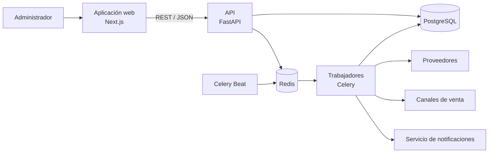
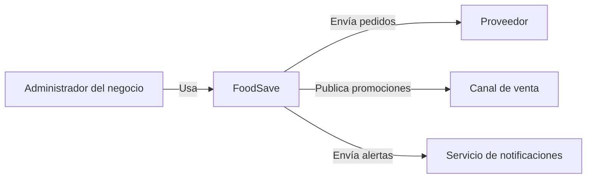
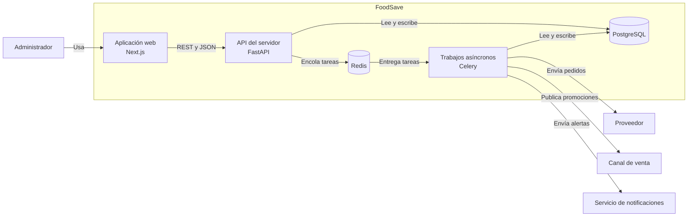
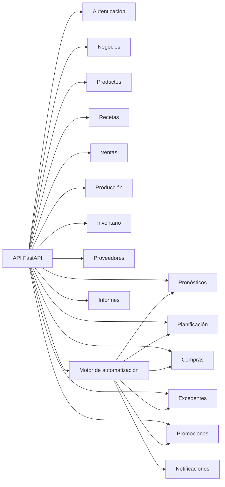
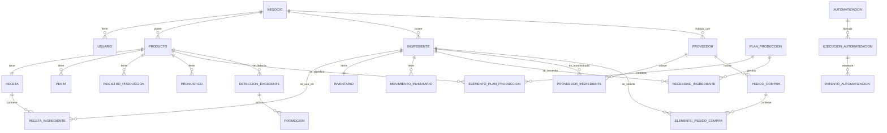

# FoodSave

FoodSave permite planificar producción y abastecimiento y prevenir desperdicio de alimentos perecibles. **El alcance inmediato es un prototipo universitario local** para un comercio y una sucursal. Su [guía de desarrollo](docs/guia-inicio-desarrollo.md), [ADR-005](docs/arquitectura/decisiones/ADR-005-instalacion-local-mvp.md), [ADR-006](docs/arquitectura/decisiones/ADR-006-identidades-lotes-pronosticos.md) y [ADR-008](docs/arquitectura/decisiones/ADR-008-pedidos-desde-el-plan.md) prevalecen sobre las referencias históricas de este README a SaaS, varias sucursales, stock en Excel permanente o promoción operativa. La demo sí contempla pedidos derivados del plan y envío real por Telegram a un chat de pruebas, con aprobación configurable. La comercialización es futura.

El núcleo local incluye acceso/configuración, programación durable, Beat, worker, PostgreSQL y Redis. Los manejadores de preparación y evaluación ML están registrados; plan, inventario, promociones y pedidos siguen pendientes. El CSV bakery puede subirse desde `/inicializacion/piloto` para cargar ventas y reservar el modelo sin copiar archivos al contenedor. El asistente de dos XLSX o cinco CSV está en `/inicializacion`; su confirmación deja la instalación pendiente hasta conectar recetas de Max y apertura de lotes de Vera.

## Arranque local de desarrollo

1. Instala Docker con Compose y copia `.env.example` a `.env`. Cambia `POSTGRES_PASSWORD` por una clave alfanumérica larga y `JWT_SECRET` por una cadena aleatoria larga; no subas `.env` a Git. `TELEGRAM_BOT_TOKEN` queda vacío hasta que Aguirre entregue y pruebe el canal con un chat propio.
2. Ejecuta `docker compose up --build -d` desde la raíz del repositorio.
3. Comprueba `docker compose exec -T api alembic current --check-heads`. El servicio `migraciones` aplica las revisiones antes de iniciar API, worker y Beat; si falla, corrige el error antes de continuar.
4. Ejecuta `docker compose exec -it api python -m app.core.crear_admin` y escribe el correo y contraseña del administrador.
5. Abre `http://localhost:3000` para iniciar sesión. La API responde en `http://localhost:8000/salud` y su documentación en `http://localhost:8000/docs`.

Para los siguientes arranques en Windows, abre `iniciar-foodsave.cmd` con doble clic: su auxiliar `iniciar-foodsave.ps1` evita arranques simultáneos del lanzador y espera a la API y a la web antes de abrir la pantalla de carga. Si falla, muestra el error real; no borra volúmenes ni contenedores. Tras cambios de código, ejecuta `iniciar-foodsave.cmd -Build` una vez para actualizar las imágenes; los siguientes clics reutilizan esas imágenes. `-NoBrowser` comprueba el arranque sin abrir el navegador. Evita ejecutar otro `docker compose up` al mismo tiempo. El primer build y la creación del administrador siguen siendo tareas de configuración únicas. Desde la pantalla **Cargar CSV**, selecciona `foodsave-ml/bakery_sales_limpio_final.csv`; el catálogo curado se carga automáticamente y el worker prepara el modelo. La pantalla muestra la ejecución y permite reintentar el entrenamiento si falla, sin subir otra vez el archivo.

Cada PC tiene su propio volumen de PostgreSQL y `model_artifacts` compartido: el worker puede guardar el futuro CBM y sus metadatos, y la API lo monta en solo lectura mediante `MODEL_ARTIFACT_DIR=/code/model_artifacts`. El volumen vacío no representa un modelo disponible. `docker compose down` detiene los servicios y conserva los datos; evita `down -v` salvo que quieras borrar intencionalmente ambos volúmenes. Para probar el trabajador: `docker compose exec api python -c "from app.workers.celery_app import tarea_prueba; print(tarea_prueba.delay('ok').get(timeout=15))"`.

## Guía rápida

- [Guías por carpeta y responsable](docs/equipo/mapa-carpetas.md).
- [Dependencias y entregas entre integrantes](docs/equipo/dependencias.md).
- [Registro obligatorio de avances](docs/equipo/avances/README.md).
- [Instrucciones para IA](AGENTS.md).

- [Alcance y criterio de demo del prototipo universitario](docs/guia-inicio-desarrollo.md).
- [Estado real de la base y puertas para desarrollar](docs/base-para-desarrollo.md): decisiones cerradas, brechas y orden de integración.
- [Especificación integral de diseño](docs/diseno/especificacion-visual.md): reglas visuales, pantallas, componentes, estados y accesibilidad.
- [Especificación funcional de módulos](docs/funcionalidades/especificacion-modulos.md): qué muestra y permite hacer cada sección.
- [Cronograma semanal](docs/equipo/cronograma.md): hitos de las semanas 1 a 16 y estado de cada entrega.
- [Responsabilidades del equipo](docs/equipo/responsabilidades.md): cada persona desarrolla interfaz, servidor y API de los módulos asignados.
- [Arquitectura y diagramas](docs/arquitectura/diagramas/README.md), incluido el [diagrama entidad-relación](docs/base_de_datos/diagrama-entidad-relacion.md).
- [Contratos de API](docs/api/contratos.md) y [rutas propuestas](docs/api/rutas-api.md).
- [Índice de documentación](docs/README.md) y [referencias visuales conservadas](docs/diseno/mockups/README.md).

## Organización del repositorio

| Carpeta | Propósito |
|---|---|
| [`docs/`](docs/README.md) | Arquitectura, diseño, funcionalidades, API, datos, automatización y equipo |
| [`frontend/`](frontend/README.md) | Interfaz Next.js y funciones por dominio |
| [`backend/`](backend/README.md) | API FastAPI, módulos, trabajos asíncronos y pruebas |
| [`scripts/`](scripts/README.md) | Herramientas de apoyo del equipo |
| [`.github/workflows/`](.github/workflows/README.md) | Flujos de integración continua |

La distribución del trabajo es por **módulo completo**: su responsable implementa interfaz, servidor, rutas de API, pruebas e integración de cada módulo asignado. Todos los módulos tienen un responsable asignado; la sección 16 detalla la propiedad de cada uno.

## Estado del proyecto

El núcleo de desarrollo tiene manifiestos, contenedores, migración inicial y acceso básico. El resto de módulos y la integración del modelo aún están pendientes. El cronograma histórico separa hitos comunicados por el equipo de objetivos propuestos; no representa por sí solo el estado actual del código.

`README.md`, `src/app`, `public` y `.github/workflows` conservan sus nombres porque las herramientas los requieren. Los nombres propios de tecnologías y la sintaxis de formatos técnicos también se mantienen.

---

# FoodSave — Documento Técnico Maestro

## 1. Propósito

Este documento define la estructura técnica, funcional y organizacional de **FoodSave**. Debe servir como referencia para arquitectura, desarrollo, integración, documentación, pruebas y división del trabajo.

Equipo:
- Axel Cueva
- Edu Sanchez
- Kevin Bohorquez
- Leonardo Vera
- Leonardo Aguirre
- Max Rojas

## 2. Definición del proyecto

**FoodSave es una plataforma de automatización preventiva para negocios que producen y comercializan alimentos perecibles.** En el MVP, cada comercio usa una instalación local independiente.

Analiza ventas, producción, inventario, recetas, insumos, proveedores, excedentes y desperdicio para:
- predecir demanda;
- generar planes de producción;
- calcular necesidades de insumos;
- detectar faltantes;
- generar y enviar pedidos;
- seleccionar proveedores;
- detectar excedentes;
- activar promociones;
- verificar resultados;
- reintentar ante fallos;
- notificar incidencias;
- registrar resultados;
- alimentar reportes y métricas.

Ciclo principal:

```text
DETECTAR
↓
DECIDIR
↓
ACTUAR
↓
VERIFICAR
↓
CORREGIR / REINTENTAR
↓
NOTIFICAR
↓
REGISTRAR RESULTADO
```

## 3. Flujo funcional principal

```text
Ventas históricas
↓
Predicción de demanda
↓
Plan de producción
↓
Cálculo de ingredientes
↓
Detección de faltantes
↓
Generación de pedidos
↓
Envío a proveedores
↓
Verificación del envío
↓
Producción
↓
Ventas durante el día
↓
Detección de excedentes
↓
Promoción automática
↓
Verificación del efecto
↓
Registro del resultado
↓
Panel e informes
```

## 4. Alcance

FoodSave se centra en:
- planificación;
- automatización;
- abastecimiento;
- prevención de desperdicio;
- control;
- trazabilidad;
- seguimiento de resultados.

No debe convertirse en:
- ERP completo;
- POS completo;
- sistema contable;
- facturación electrónica;
- CRM;
- recursos humanos;
- delivery;
- ecommerce completo;
- sistema de pagos.

Estas áreas pueden existir como integraciones externas.


# 5. Arquitectura

## 5.1 Decisión arquitectónica

Se propone un **monolito modular con procesamiento asíncrono para automatizaciones**.

Ventajas:
- módulos funcionales bien delimitados;
- menor complejidad operativa;
- despliegue sencillo;
- integración directa entre dominios;
- posibilidad de trabajar en paralelo;
- posibilidad futura de extraer servicios.

## 5.2 Conjunto de tecnologías

### Interfaz
- Next.js
- TypeScript
- Tailwind CSS
- shadcn/ui
- Recharts
- TanStack Query
- React Hook Form
- Zod

### Servidor
- Python
- FastAPI
- Pydantic
- SQLAlchemy
- Alembic

### Persistencia
- PostgreSQL

### Automatización
- Celery
- Redis
- Celery Beat

### Datos / predicción
- Pandas
- NumPy
- scikit-learn

### Seguridad
- JWT
- bcrypt / passlib

### Pruebas
- Pytest
- Playwright
- Vitest / React pruebas Library opcional

### Infraestructura
- Docker
- Docker Compose

### CI/CD
- GitHub Actions

### Diseño y documentación
- Figma
- OpenAPI / Swagger
- Markdown
- Mermaid

## 5.3 Arquitectura general

La interfaz se comunica con la API. El servidor guarda datos en PostgreSQL y envía trabajos a Redis para que Celery los procese. Celery Beat programa las ejecuciones periódicas.


```mermaid
flowchart LR
    U[Administrador] --> F[Aplicación web<br/>Next.js]
    F -->|REST / JSON| A[API<br/>FastAPI]
    A --> D[(PostgreSQL)]
    A --> R[(Redis)]
    R --> W[Trabajadores<br/>Celery]
    B[Celery Beat] --> R
    W --> D
    W --> P[Proveedores]
    W --> C[Canales de venta]
    W --> N[Servicio de notificaciones]
```

# 6. Vistas C4

## 6.1 Contexto

Personas y sistemas externos que interactúan con FoodSave.


```mermaid
flowchart LR
    administrador[Administrador del negocio] -->|Usa| foodsave[FoodSave]
    foodsave -->|Envía pedidos| proveedor[Proveedor]
    foodsave -->|Publica promociones| canal[Canal de venta]
    foodsave -->|Envía alertas| avisos[Servicio de notificaciones]
```

## 6.2 Contenedores

Aplicación web, API, trabajos asíncronos y almacenamiento.


```mermaid
flowchart LR
    administrador[Administrador]
    proveedor[Proveedor]
    canal[Canal de venta]
    avisos[Servicio de notificaciones]

    subgraph FoodSave
        interfaz[Aplicación web<br/>Next.js]
        api[API del servidor<br/>FastAPI]
        trabajador[Trabajos asíncronos<br/>Celery]
        base[(PostgreSQL)]
        cola[(Redis)]
    end

    administrador -->|Usa| interfaz
    interfaz -->|REST y JSON| api
    api -->|Lee y escribe| base
    api -->|Encola tareas| cola
    cola -->|Entrega tareas| trabajador
    trabajador -->|Lee y escribe| base
    trabajador -->|Envía pedidos| proveedor
    trabajador -->|Publica promociones| canal
    trabajador -->|Envía alertas| avisos
```

## 6.3 Componentes

Módulos principales del servidor.


```mermaid
flowchart LR
    api[API FastAPI]
    autenticacion[Autenticación]
    negocios[Negocios]
    productos[Productos]
    recetas[Recetas]
    ventas[Ventas]
    produccion[Producción]
    inventario[Inventario]
    pronosticos[Pronósticos]
    planificacion[Planificación]
    proveedores[Proveedores]
    compras[Compras]
    excedentes[Excedentes]
    promociones[Promociones]
    automatizaciones[Motor de automatización]
    informes[Informes]
    notificaciones[Notificaciones]

    api --> autenticacion
    api --> negocios
    api --> productos
    api --> recetas
    api --> ventas
    api --> produccion
    api --> inventario
    api --> pronosticos
    api --> planificacion
    api --> proveedores
    api --> compras
    api --> excedentes
    api --> promociones
    api --> automatizaciones
    api --> informes

    automatizaciones --> pronosticos
    automatizaciones --> planificacion
    automatizaciones --> compras
    automatizaciones --> excedentes
    automatizaciones --> promociones
    automatizaciones --> notificaciones
```

# 7. Módulos funcionales

## 7.1 Autenticación

**Responsable:** Axel Cueva.

Responsabilidades:
- inicio de sesión;
- renovación de la credencial de acceso;
- protección de rutas;
- roles.

Entidades:
- Usuario
- Rol

Roles iniciales:
- ADMINISTRADOR
- OPERADOR

## 7.2 Negocios

**Responsable:** Axel Cueva.

Entidad:
- negocio

Campos sugeridos:
- id
- nombre
- zona_horaria
- hora_apertura
- hora_cierre
- moneda
- creado_en
- actualizado_en

## 7.3 Productos

**Responsable:** Edu Sanchez.

Entidad:
- producto

Campos:
- id
- nombre
- categoria
- precio_venta
- costo_estimado
- activo
- creado_en
- actualizado_en

Funcionalidades:
- crear;
- editar;
- consultar;
- listar;
- filtrar;
- desactivar.

## 7.4 Ingredientes y recetas

**Responsable:** Max Rojas.

Entidades:
- ingrediente
- receta
- IngredienteReceta

Ejemplo:
```text
Empanada de pollo
100 g pollo
80 g harina
30 g cebolla
```

Funcionalidades:
- registrar ingredientes;
- crear receta;
- editar receta;
- asociar ingredientes;
- definir cantidad por unidad.

## 7.5 Ventas

**Responsable:** Edu Sanchez.

Entidad:
- venta

Campos:
- id
- producto_id
- cantidad
- precio_unitario
- total
- fecha_venta
- hora_venta
- origen
- creado_en

Funcionalidades:
- registrar venta;
- consultar histórico;
- filtrar por fecha;
- filtrar por producto;
- importar CSV;
- agrupar ventas.

## 7.6 Producción

**Responsable:** Leonardo Vera.

Entidad:
- registro de producción

Campos:
- id
- producto_id
- fecha
- cantidad_planificada
- cantidad_producida
- creado_en

Funcionalidades:
- registrar producción;
- actualizar cantidad;
- comparar el plan con la cantidad producida;
- consultar historial.

## 7.7 Inventario

**Responsable:** Leonardo Vera.

Entidades:
- Inventario
- movimiento de inventario

Inventario:
- id
- ingrediente_id
- existencias_actuales
- unidad
- existencias_minimas
- actualizado_en

movimiento de inventario:
- id
- ingrediente_id
- tipo
- cantidad
- motivo
- creado_en

Tipos:
- ENTRADA
- SALIDA
- AJUSTE
- PRODUCCION
- DESPERDICIO

Funcionalidades:
- consultar existencias;
- registrar entrada;
- registrar salida;
- ajustar;
- detectar existencias bajas;
- consultar movimientos.


## 7.8 Pronósticos

**Responsable:** Kevin Bohorquez.

Responsabilidad:
- estimar demanda futura.

Entradas:
- ventas históricas;
- producto;
- día de semana;
- tendencia reciente.

Variables futuras:
- feriados;
- clima;
- promociones;
- temporada;
- eventos.

Entidad:
- pronóstico

Campos:
- id
- producto_id
- fecha_pronostico
- cantidad_pronosticada
- confianza
- nombre_modelo
- version_modelo
- creado_en

Método base:
```text
Promedio histórico por día de semana
+
media móvil
```

Métodos futuros:
- Random Forest
- Gradient Boosting
- XGBoost

## 7.9 Planificación

**Responsable:** Max Rojas.

Fórmula conceptual:

```text
Producción recomendada =
demanda prevista
-
existencias del producto terminado
+
margen de seguridad
```

Entidades:
- plan de producción
- elemento del plan de producción
- necesidad de ingredientes

plan de producción:
- id
- fecha_plan
- estado
- creado_en

elemento del plan de producción:
- id
- plan_produccion_id
- producto_id
- cantidad_pronosticada
- cantidad_existente
- cantidad_seguridad
- cantidad_recomendada

necesidad de ingredientes:
- id
- plan_produccion_id
- ingrediente_id
- cantidad_requerida
- cantidad_disponible
- cantidad_faltante

## 7.10 Proveedores

**Responsable:** Leonardo Aguirre.

Entidades:
- proveedor
- insumo del proveedor

proveedor:
- id
- nombre
- correo
- telefono
- medio_contacto_preferido
- activo
- creado_en

insumo del proveedor:
- proveedor_id
- ingrediente_id
- precio_unitario
- pedido_minimo
- plazo_entrega_estimado
- preferido

Funcionalidades:
- crear;
- actualizar;
- desactivar;
- asociar insumos;
- marcar proveedor habitual;
- registrar precio.

## 7.11 Compras

**Responsable:** Leonardo Aguirre.

Flujo:
```text
NecesidadIngrediente
↓
faltante > 0
↓
buscar proveedor
↓
agrupar insumos
↓
crear pedido
↓
enviar
↓
verificar
```

Entidades:
- pedido de compra
- elemento del pedido de compra

Estados:
- GENERADO
- PENDIENTE
- ENVIANDO
- ENVIADO
- CONFIRMADO
- REINTENTANDO
- FALLIDO
- CANCELADO

## 7.12 Excedentes

**Responsable:** Leonardo Vera.

Cálculo conceptual:
```text
existencias_restantes = producido - vendido

excedente_estimado =
existencias_restantes - ventas_estimadas_hasta_cierre
```

Entidad:
- detección de excedentes

Campos:
- id
- producto_id
- detectado_en
- existencias_actuales
- ventas_restantes_estimadas
- excedente_estimado
- nivel_riesgo
- estado

Riesgo:
- BAJO
- MEDIO
- ALTO
- CRITICO

## 7.13 Promociones

**Responsable:** Leonardo Vera.

Entidad:
- promoción

Campos:
- id
- producto_id
- deteccion_excedente_id
- porcentaje_descuento
- inicia_en
- termina_en
- estado
- creado_en

Estados:
- PROGRAMADO
- ACTIVO
- FINALIZADO
- CANCELADO
- FALLIDO

Regla ejemplo:
```text
SI nivel_riesgo = ALTO
Y tiempo_hasta_cierre <= 90 minutos
ENTONCES porcentaje_descuento = 10%
```


# 8. Automatización y control

**Responsable:** Axel Cueva.

## 8.1 Automatización

Campos:
- id
- tipo
- nombre
- habilitado
- programacion
- maximo_reintentos
- configuracion
- creado_en
- actualizado_en

Tipos:
- PLANIFICACION_DIARIA
- PEDIDO_PROVEEDOR
- SEGUIMIENTO_EXCEDENTES
- ACTIVACION_PROMOCION
- SEGUIMIENTO_PROMOCION

## 8.2 Ejecución de automatización

Campos:
- id
- automatizacion_id
- estado
- inicio_en
- fin_en
- datos_entrada
- datos_salida
- mensaje_error
- cantidad_reintentos

Estados:
- PENDIENTE
- EN_EJECUCION
- VERIFICANDO
- COMPLETADO
- REINTENTANDO
- FALLIDO
- CANCELADO

## 8.3 Intento de automatización

Campos:
- id
- ejecucion_automatizacion_id
- numero_intento
- inicio_en
- fin_en
- estado
- mensaje_error

## 8.4 Patrón de control

```text
ejecutar()
↓
verificar()
↓
¿correcto?

SI
↓
COMPLETADO

NO
↓
¿quedan reintentos?

SI
↓
REINTENTANDO
↓
ejecutar()

NO
↓
FALLIDO
↓
notificar()
```

## 8.5 Automatización — Planificación diaria

Disparador:
```text
22:00 todos los días
```

Flujo:
```text
leer ventas
↓
validar información
↓
generar pronóstico
↓
generar plan
↓
calcular ingredientes
↓
consultar inventario
↓
generar faltantes
↓
guardar resultado
```

Control:
```text
¿Plan generado correctamente?
NO → reintentar
nuevo fallo → registrar error → notificar
```

## 8.6 Automatización — Abastecimiento

```text
faltante > 0
↓
buscar proveedor
↓
agrupar necesidades
↓
crear pedido
↓
enviar
↓
verificar envío
```

Control:
```text
envío no confirmado
↓
reintentar
↓
si vuelve a fallar
FALLIDO
↓
notificar
```

## 8.7 Automatización — Control de excedentes

Disparador:
```text
cada 30 minutos
```

Flujo:
```text
leer producción
↓
leer ventas
↓
calcular existencias restantes
↓
predecir venta restante
↓
calcular excedente
↓
calcular riesgo
```

## 8.8 Automatización — Promoción preventiva

```text
riesgo detectado
↓
seleccionar estrategia
↓
calcular descuento
↓
crear promoción
↓
publicar
↓
verificar publicación
```

## 8.9 Automatización — Control de promoción

```text
esperar intervalo
↓
leer ventas nuevas
↓
recalcular excedente
↓
¿riesgo disminuyó?
```

Si sí:
```text
mantener / finalizar
```

Si no:
```text
recalcular acción
↓
ejecutar nueva promoción
```


# 9. Notificaciones

**Responsable:** Axel Cueva.

Entidad:
- notificación

Campos:
- id
- usuario_id
- tipo
- titulo
- mensaje
- leida
- creado_en

Canales iniciales:
- notificación interna;
- correo.

Posibles integraciones:
- WhatsApp;
- Slack;
- notificaciones móviles.

# 10. Informes

**Responsable:** Kevin Bohorquez.

Métricas:

## Operación
- producción;
- ventas;
- excedentes;
- existencias;
- pedidos.

## Predicción
- MAE;
- MAPE;
- precisión aproximada.

## Automatización
- ejecuciones;
- completadas;
- fallidas;
- reintentos;
- tiempo promedio.

## Impacto económico
- pérdida potencial;
- pérdida evitada;
- costo de desperdicio.

## Desperdicio
- unidades desperdiciadas;
- unidades recuperadas;
- kg desperdiciados;
- kg evitados.


# 11. Modelo conceptual de datos

Este diagrama muestra relaciones conceptuales; todavía no define tablas ni columnas definitivas.


```mermaid
erDiagram
    NEGOCIO ||--o{ USUARIO : tiene
    NEGOCIO ||--o{ PRODUCTO : posee
    NEGOCIO ||--o{ INGREDIENTE : posee
    NEGOCIO ||--o{ PROVEEDOR : trabaja_con

    PRODUCTO ||--|| RECETA : tiene
    RECETA ||--o{ RECETA_INGREDIENTE : contiene
    INGREDIENTE ||--o{ RECETA_INGREDIENTE : se_usa_en

    PRODUCTO ||--o{ VENTA : tiene
    PRODUCTO ||--o{ REGISTRO_PRODUCCION : tiene
    PRODUCTO ||--o{ PRONOSTICO : tiene

    INGREDIENTE ||--|| INVENTARIO : tiene
    INGREDIENTE ||--o{ MOVIMIENTO_INVENTARIO : tiene

    PLAN_PRODUCCION ||--o{ ELEMENTO_PLAN_PRODUCCION : contiene
    PRODUCTO ||--o{ ELEMENTO_PLAN_PRODUCCION : se_planifica

    PLAN_PRODUCCION ||--o{ NECESIDAD_INGREDIENTE : genera
    INGREDIENTE ||--o{ NECESIDAD_INGREDIENTE : se_necesita

    PROVEEDOR ||--o{ PROVEEDOR_INGREDIENTE : ofrece
    INGREDIENTE ||--o{ PROVEEDOR_INGREDIENTE : es_suministrado

    PROVEEDOR ||--o{ PEDIDO_COMPRA : recibe
    PEDIDO_COMPRA ||--o{ ELEMENTO_PEDIDO_COMPRA : contiene
    INGREDIENTE ||--o{ ELEMENTO_PEDIDO_COMPRA : se_solicita

    PRODUCTO ||--o{ DETECCION_EXCEDENTE : se_detecta
    DETECCION_EXCEDENTE ||--o{ PROMOCION : activa

    AUTOMATIZACION ||--o{ EJECUCION_AUTOMATIZACION : ejecuta
    EJECUCION_AUTOMATIZACION ||--o{ INTENTO_AUTOMATIZACION : reintenta
```

# 12. API propuesta

Base:
```text
/api/v1
```

## Autenticación
```http
POST /autenticacion/iniciar-sesion
POST /autenticacion/renovar
GET  /autenticacion/mi-perfil
```

## Negocios
```http
GET   /negocios/actual
PATCH /negocios/actual
```

## Productos
```http
GET    /productos
GET    /productos/{id}
POST   /productos
PUT    /productos/{id}
DELETE /productos/{id}
```

## Ingredientes
```http
GET    /ingredientes
GET    /ingredientes/{id}
POST   /ingredientes
PUT    /ingredientes/{id}
DELETE /ingredientes/{id}
```

## Recetas
```http
GET  /productos/{producto_id}/receta
POST /productos/{producto_id}/receta
PUT  /productos/{producto_id}/receta
```

## Ventas
```http
GET  /ventas
POST /ventas
POST /ventas/importar
GET  /ventas/resumen
```

## Producción
```http
GET  /produccion
POST /produccion
PUT  /produccion/{id}
```

## Inventario
```http
GET  /inventario
GET  /inventario/{ingrediente_id}
POST /inventario/movimientos
GET  /inventario/movimientos
GET  /inventario/existencias-bajas
```

## Pronósticos
```http
GET  /pronosticos
GET  /pronosticos/{fecha}
POST /pronosticos/ejecutar
```

## Planificación
```http
GET  /planes
GET  /planes/{id}
POST /planes/generar
GET  /planes/{id}/ingredientes
```

## Proveedores
```http
GET    /proveedores
GET    /proveedores/{id}
POST   /proveedores
PUT    /proveedores/{id}
DELETE /proveedores/{id}
POST   /proveedores/{id}/ingredientes
```

## Compras
```http
GET  /pedidos-compra
GET  /pedidos-compra/{id}
POST /pedidos-compra/generar
POST /pedidos-compra/{id}/enviar
POST /pedidos-compra/{id}/reintentar
```

## Excedentes
```http
GET  /excedentes
GET  /excedentes/actual
POST /excedentes/ejecutar
```

## Promociones
```http
GET  /promociones
GET  /promociones/{id}
POST /promociones/generar
POST /promociones/{id}/activar
POST /promociones/{id}/detener
```

## Automatizaciones
```http
GET  /automatizaciones
GET  /automatizaciones/{id}
PUT  /automatizaciones/{id}
GET  /ejecuciones-automatizacion
GET  /ejecuciones-automatizacion/{id}
POST /automatizaciones/{id}/ejecutar
POST /ejecuciones-automatizacion/{id}/reintentar
```

## Informes
```http
GET /informes/panel
GET /informes/operacion
GET /informes/desperdicio
GET /informes/pronosticos
GET /informes/automatizaciones
```


# 13. Estructura del repositorio

Cada subcarpeta contiene un `README.md` que describe su propósito. Esta es la estructura documental y de carpetas creada hasta ahora; los archivos de aplicación se añadirán durante la implementación.

```text
foodsave/
├── README.md
├── .gitignore
├── .env.example
├── docs/
│   ├── arquitectura/
│   │   ├── vision_general.md
│   │   ├── decisiones/
│   │   ├── c4/
│   │   └── diagramas/
│   ├── api/
│   ├── diseno/
│   ├── funcionalidades/
│   ├── base_de_datos/
│   ├── automatizacion/
│   └── equipo/
├── frontend/
│   ├── public/
│   └── src/
│       ├── app/
│       │   ├── iniciar-sesion/
│       │   ├── panel/
│       │   ├── productos/
│       │   ├── produccion/
│       │   ├── inventario/
│       │   ├── compras/
│       │   ├── proveedores/
│       │   ├── excedentes/
│       │   ├── promociones/
│       │   ├── automatizaciones/
│       │   ├── informes/
│       │   └── configuracion/
│       ├── components/
│       │   ├── ui/
│       │   ├── layout/
│       │   ├── panel/
│       │   ├── charts/
│       │   ├── tables/
│       │   ├── automatizacion/
│       │   └── forms/
│       ├── features/
│       │   ├── productos/
│       │   ├── ingredientes/
│       │   ├── recetas/
│       │   ├── ventas/
│       │   ├── produccion/
│       │   ├── inventario/
│       │   ├── planificacion/
│       │   ├── proveedores/
│       │   ├── compras/
│       │   ├── excedentes/
│       │   ├── promociones/
│       │   ├── desperdicio/
│       │   └── automatizaciones/
│       ├── services/
│       ├── hooks/
│       ├── types/
│       ├── utils/
│       └── constants/
├── backend/
│   ├── migrations/
│   ├── tests/
│   │   ├── unit/
│   │   ├── integration/
│   │   └── fixtures/
│   └── app/
│       ├── core/
│       ├── shared/
│       │   ├── enums/
│       │   ├── schemas/
│       │   ├── utils/
│       │   └── events/
│       ├── modules/
│       │   ├── autenticacion/
│       │   ├── negocios/
│       │   ├── productos/
│       │   ├── ingredientes/
│       │   ├── recetas/
│       │   ├── ventas/
│       │   ├── produccion/
│       │   ├── inventario/
│       │   ├── pronosticos/
│       │   ├── planificacion/
│       │   ├── proveedores/
│       │   ├── compras/
│       │   ├── excedentes/
│       │   ├── promociones/
│       │   ├── desperdicio/
│       │   ├── automatizaciones/
│       │   ├── notificaciones/
│       │   └── informes/
│       ├── workers/
│       │   ├── tasks/
│       │   └── retry/
│       └── integrations/
│           ├── proveedores/
│           ├── notificaciones/
│           └── canales_venta/
├── scripts/
└── .github/
    └── workflows/
```

`src/app`, `public`, `.github/workflows` y `README.md` conservan sus nombres porque Next.js, GitHub y las herramientas de documentación los reconocen así. Los nombres propios de tecnologías, como FastAPI y PostgreSQL, también se mantienen.

Cuando comience la implementación se incorporarán `package.json`, `pyproject.toml`, archivos Dockerfile, migraciones y flujos de integración continua con contenido funcional. En Next.js, `layout.tsx` y `page.tsx` son nombres reservados y deberán conservarse. Los archivos propios del servidor pueden usar nombres en español, como `principal.py`, `rutas.py` y `servicio.py`.

# 14. Estructura interna de cada módulo del servidor

```text
modulo/
├── rutas.py
├── servicio.py
├── repositorio.py
├── modelos.py
├── esquemas.py
├── dependencias.py
├── errores.py
└── tests/
```

Responsabilidades:

- `rutas.py`: recibe solicitudes HTTP, valida parámetros y delega en el servicio.
- `servicio.py`: implementa reglas de negocio y coordina operaciones del módulo.
- `repositorio.py`: realiza consultas y operaciones de persistencia.
- `modelos.py`: define modelos de SQLAlchemy.
- `esquemas.py`: define esquemas de Pydantic.
- `dependencias.py`: reúne dependencias del módulo.
- `errores.py`: define errores propios del dominio.
- `tests/`: comprueba reglas de negocio y rutas.

Un módulo no accede directamente al repositorio de otro. Por ejemplo, planificación debe solicitar las existencias al servicio de inventario.

# 15. Contratos entre módulos

## Planificación → Pronósticos

```python
servicio_pronosticos.obtener_pronostico(producto_id, fecha)
```

Respuesta:
```json
{
  "producto_id": 1,
  "fecha": "2026-09-24",
  "cantidad_pronosticada": 60,
  "confianza": 0.93
}
```

## Planificación → Inventario

```python
servicio_inventario.obtener_existencias(ingrediente_id)
```

Respuesta:
```json
{
  "ingrediente_id": 5,
  "existencias": 2,
  "unidad": "kg"
}
```

## Planificación → Compras

```json
{
  "ingrediente_id": 5,
  "requerido": 5.8,
  "disponible": 2,
  "faltante": 3.8
}
```

## Compras → Proveedores

```python
servicio_proveedores.buscar_proveedor_preferido(ingrediente_id)
```

## Excedentes → Promociones

```json
{
  "producto_id": 1,
  "existencias_actuales": 24,
  "ventas_estimadas": 9,
  "excedente_estimado": 15,
  "riesgo": "ALTO"
}
```


# 16. División del equipo

El reparto vigente equilibra seis bloques completos por complejidad técnica. Cada integrante entrega interfaz, backend, API, datos, pruebas e integración. La definición detallada, tareas A01–M04 y criterios de terminado están en [responsabilidades](docs/equipo/responsabilidades.md). El reparto anterior queda sustituido.

| Responsable | Bloque | Dificultad principal |
|---|---|---|
| Axel Cueva | Acceso, configuración y motor de automatizaciones | Concurrencia, programación durable y recuperación de tareas. |
| Edu Sanchez | Inicialización, productos, ventas y estructura visual compartida | Validación de archivos, consistencia entre dominios y carga atómica. |
| Kevin Bohorquez | Modelo predictivo, evaluación histórica y dashboard | Reproducibilidad, ventanas temporales, cobertura y ausencia de fuga de datos. |
| Leonardo Vera | Inventario por lotes y promociones sugeridas | Atomicidad de saldos, concurrencia, caducidad y reloj simulado. |
| Leonardo Aguirre | Proveedores, pedidos y Telegram | Efectos externos, estados de compra y duplicados entre planes. |
| Max Rojas | Ingredientes, recetas y planificación | Versiones de recetas, cálculos decimales e integración pronóstico/stock/compras. |

## Axel Cueva

- **A01 — Completar identidad, roles y configuración:** Validar zona horaria y moneda; exponer modo de aprobación; uniformar errores y mantener acceso/sesión en UI.
- **A02 — Construir programaciones y ejecuciones durables:** Modelos, rutas, pantallas, estados, clave idempotente, intentos y consulta de resultados.
- **A03 — Implementar Beat y recuperación:** Despachador, lease, reentregas, reintentos de tareas internas y publicación recuperable tras commit.
- **A04 — Preparar infraestructura común:** Compose, imágenes, volúmenes y variables; integrar requisitos ML de Kevin y canal de Aguirre; CI y migraciones.

Su entrega incluye las pruebas y criterios detallados del [reparto](docs/equipo/responsabilidades.md) y el registro [cueva.md](docs/equipo/avances/cueva.md).

## Edu Sanchez

- **E01 — Definir y cargar productos y ventas:** Mapear SKU externos, persistir ventas agregadas, conservar revisiones y distinguir ausencia de cero.
- **E02 — Construir asistente XLSX/CSV:** Lectores, validación, vista previa, huellas y confirmación; orquestar servicios de Max y Vera en una transacción.
- **E03 — Preparar primera inicialización:** Estado durable, datos de ejemplo, archivos y aviso de preparación ML; pedir ejecución a Axel y entrada a Kevin.
- **E04 — Entregar pantallas y piezas comunes:** Productos, ventas y asistente; navegación, formularios y estados reutilizables; contratos del cliente HTTP con Axel.

Su entrega incluye las pruebas y criterios detallados del [reparto](docs/equipo/responsabilidades.md) y el registro [sanchez.md](docs/equipo/avances/sanchez.md).

## Kevin Bohorquez

- **K01 — Extraer entrenamiento reutilizable:** Llevar la lógica del notebook a funciones ejecutables en worker; partición temporal y validaciones del artefacto.
- **K02 — Implementar inferencia y persistencia:** Construir las 13 características por calendario, validar modelo y cobertura, guardar corrida y pronósticos.
- **K03 — Implementar evaluación histórica:** Backtest por fecha y comparación posterior con revisión de venta; MAE, WAPE, ±20% y cobertura.
- **K04 — Construir dashboard y vistas de pronóstico:** API de métricas, serie histórica, comparación por producto, fecha y versión; gráficos con componentes de Edu.

Su entrega incluye las pruebas y criterios detallados del [reparto](docs/equipo/responsabilidades.md) y el registro [bohorquez.md](docs/equipo/avances/bohorquez.md).

## Leonardo Vera

- **V01 — Implementar lotes y apertura:** Persistir lote, unidad, caducidad, saldo y procedencia; servicio de apertura para el importador de Edu.
- **V02 — Implementar ajustes y disponibilidad:** Bloqueo/transacción, delta, motivo, clave y hora efectiva; agregación de stock elegible por fecha para Max.
- **V03 — Integrar regla de promoción:** Versionar regla y persistir aceptación/rechazo; programar evaluación mediante Axel tras el ajuste.
- **V04 — Entregar inventario y promoción en UI:** Saldos, filtros por lote, movimientos, formulario de ajuste y detalle de evaluación.

Su entrega incluye las pruebas y criterios detallados del [reparto](docs/equipo/responsabilidades.md) y el registro [vera.md](docs/equipo/avances/vera.md).

## Leonardo Aguirre

- **L01 — Implementar proveedores y ofertas:** Proveedor activo, chat de prueba, ingrediente, unidad de compra, factor, mínimo y múltiplo.
- **L02 — Generar pedidos desde necesidades:** Agrupar por proveedor y preservar cálculo; cerrar con Max la prevención de recompra entre planes de la misma fecha.
- **L03 — Implementar aprobación y canal:** Estados de compra, snapshot de modo, aprobación administrativa, bot y mensaje real al chat propio.
- **L04 — Resolver fallos y entregar UI:** Pantallas de proveedor/pedido/envío, destino bloqueado, timeout incierto y conciliación con evidencia.

Su entrega incluye las pruebas y criterios detallados del [reparto](docs/equipo/responsabilidades.md) y el registro [aguirre.md](docs/equipo/avances/aguirre.md).

## Max Rojas

- **M01 — Implementar ingredientes y recetas:** Unidades base, relaciones, versiones y servicios para primera carga; formularios de consulta/edición acordados.
- **M02 — Calcular plan de producción:** Consumir corrida de Kevin y stock de Vera; aplicar max(0, pronóstico-stock) y guardar snapshots.
- **M03 — Calcular necesidades y faltantes:** Agregar ingredientes de todos los productos, redondear al final, guardar requerido/disponible/faltante y entregar a Aguirre.
- **M04 — Entregar pantalla y contrato del plan:** Detalle, trazas de receta/stock/pronóstico, avisos y enlace a pedidos; versiones y respuesta API.

Su entrega incluye las pruebas y criterios detallados del [reparto](docs/equipo/responsabilidades.md) y el registro [rojas.md](docs/equipo/avances/rojas.md).

Axel coordina infraestructura; Edu coordina UI común. Cada dueño implementa sus servicios y pantallas. Kevin mantiene dashboard y gráficos; Max planificación; Vera promociones. Las carpetas futuras de producción, desperdicio, notificaciones e informes operativos no se suman a la carga de la demo.

# 17. Dependencias del equipo

| Entrega | Responsable | Consumidor |
|---|---|---|
| Identidad y motor de tareas | Axel | Los cinco bloques de dominio |
| Productos, ventas e importación | Edu | Kevin, Max y Vera |
| Ingredientes y recetas | Max | Importador de Edu, inventario de Vera y ofertas de Aguirre |
| Apertura y disponibilidad de lotes | Vera | Importador de Edu y plan de Max |
| Corrida de pronóstico | Kevin | Plan de Max |
| Necesidades agregadas del plan | Max | Pedidos de Aguirre |
| Proveedor, pedido y estado Telegram | Aguirre | UI de compras y ejecución de Axel |
| Métricas históricas | Kevin | Su dashboard, sobre layout de Edu |

La [matriz de dependencias](docs/equipo/dependencias.md) explica qué puede adelantarse con fixtures y qué bloquea integración real. No se espera un módulo completo: se entrega primero contrato y servicio mínimo. Edu orquesta la primera carga usando servicios de Max/Vera en una misma transacción. Cada dueño escribe su tarea; Axel ofrece el motor.

# 18. Entregables y registro de avances

Antes de implementar una frontera, su dueño publica tablas/restricciones, cuerpo de API, estados, errores y ejemplos. Una entrega termina cuando la API y pantalla propias usan persistencia real, sus pruebas pasan y un consumidor puede reproducir el ejemplo.

**Instrucción para cada integrante y su IA:** al cerrar un avance significativo, actualizar el resumen vigente y bitácora de [su registro](docs/equipo/avances/README.md). Incluir tarea, comportamiento disponible, archivos clave, contrato/ejemplo, pruebas ejecutadas, configuración, bloqueo y siguiente paso. Si queda parcial, indicar exactamente qué falta. El siguiente desarrollador parte del registro y los enlaces, sin tener que recorrer todo el código.

Cada carpeta fuente/documental incluye `GUIA_DESARROLLO.md` con responsable, alcance, tareas, dependencias y aceptación. Consultar [mapa de carpetas](docs/equipo/mapa-carpetas.md) y [AGENTS.md](AGENTS.md). Cualquier cambio de contrato actualiza también la guía local y el registro de avance.

# 19. Flujo de trabajo con Git

Cada integrante trabaja en una rama permanente con su apellido en minúsculas: `cueva`, `sanchez`, `bohorquez`, `vera`, `aguirre` y `rojas`. `main` conserva la versión estable. La descripción completa y los comandos están en [flujo-git.md](docs/equipo/flujo-git.md).

Para crear una rama desde la versión actual de `main` y publicarla:

```bash
git fetch origin
git switch main
git pull --ff-only origin main
git switch -c cueva
git push -u origin cueva
```

Repite el último par de comandos con el apellido correspondiente. Cada integrante sube sus cambios a su rama, solicita revisión y la integra a `main` cuando las pruebas y la revisión estén completas.

Convención de mensajes de cambios:

```text
funcion(inventario): agregar movimiento de existencias
correccion(compras): evitar pedidos duplicados
prueba(automatizacion): verificar politica de reintentos
```

Cada solicitud debe incluir descripción, módulo afectado, forma de probarlo, dependencias y capturas si aplica. Antes de incorporarla, deben pasar las pruebas y el análisis estático, recibir aprobación de revisión y no tener conflictos.

# 20. Orden de construcción

1. **Contratos y núcleo:** los seis cierran sus interfaces; Axel completa identidad/motor y Edu estructura visual compartida.
2. **Catálogos y transacciones:** Edu productos/ventas; Max ingredientes/recetas; Vera lotes/apertura; Aguirre proveedor/oferta.
3. **Carga y modelo:** Edu integra carga atómica; Kevin entrena e infiere mediante worker de Axel.
4. **Plan y compra:** Max integra corrida/stock y entrega necesidades; Aguirre genera pedido y aplica aprobación/Telegram.
5. **Evaluación y promoción:** Kevin integra métricas/panel; Vera ajusta stock y evalúa promoción vía motor común.
6. **Recuperación y entrega:** los seis prueban fronteras, reentregas, rollback y fallos; actualizan registros y demuestran el recorrido.

La [matriz de dependencias](docs/equipo/dependencias.md) detalla lo que cada integrante puede adelantar en paralelo.

# 21. Flujos de extremo a extremo

## Planificación y abastecimiento

```text
Venta → Pronóstico → Plan de producción → Necesidades de ingredientes
→ Inventario → Faltantes → Proveedor → Pedido de compra
→ Ejecución automática → Envío → Verificación → Resultado
```

## Excedentes

```text
Producción + Ventas → Existencias restantes → Detección de excedente
→ Nivel de riesgo → Promoción → Ejecución automática
→ Publicación → Espera → Medición → Nuevo cálculo
```

# 22. Política de reintentos

La configuración inicial permite dos reintentos después del primer intento fallido (`maximo_reintentos = 2`). Cada fallo debe quedar registrado.

**Decisión de producto pendiente:** la pantalla de ejecución expresa «2 de 2» intentos y la configuración rotula «Intentos de reenvío: 2». Antes de implementar el contador y los reenvíos, el equipo debe acordar si el límite indica intentos totales o reintentos adicionales y unificar interfaz, API y regla del servidor.

```text
Primer intento → Fallo → Segundo intento → Fallo → Tercer intento
→ Fallo definitivo → Notificación
```

# 23. Registro de eventos

Cada automatización debe registrar la fecha y hora, su identificador, el identificador de ejecución, el número de intento, el estado, la duración, el error y el resultado. Estos datos permiten reconstruir qué ocurrió y por qué.

Los nombres concretos de campos se definirán al implementar el formato de los registros.

# 24. Observabilidad funcional

El sistema debe permitir consultar:
- qué automatización se ejecutó;
- cuándo;
- qué datos recibió;
- qué decidió;
- qué acción realizó;
- si funcionó;
- cuántas veces reintentó;
- qué error ocurrió.


# 25. Seguridad

Servidor:
- JWT;
- hash de contraseñas;
- autorización por negocio;
- validación Pydantic;
- protección de secretos;
- CORS;
- limitación de solicitudes en una fase futura.

La API se expone solo en la computadora local durante el desarrollo. El acceso a operaciones requiere autenticación y los datos de otro comercio permanecen en otra instalación y base de datos.

# 26. Variables de entorno

```text
ENTORNO_APLICACION=
URL_BASE_DATOS=
URL_REDIS=
JWT_SECRETO=
JWT_ALGORITMO=
DURACION_TOKEN_ACCESO_MINUTOS=
SMTP_SERVIDOR=
SMTP_PUERTO=
SMTP_USUARIO=
SMTP_CONTRASENA=
URL_INTERFAZ=
```

Nunca subir secretos al repositorio.

# 27. Docker Compose

Servicios previstos:

```text
interfaz
servidor
postgres
redis
trabajador-celery
planificador-celery
```

# 28. Pruebas

## Pruebas unitarias

- predicción de demanda;
- planificación de producción;
- movimientos de inventario;
- selección de proveedores y pedidos;
- detección de excedentes;
- promociones;
- ejecución y reintentos de automatizaciones.

## Pruebas de integración

Comprobar, por ejemplo, el flujo de registro de venta, generación de pronóstico y creación del plan.

## Pruebas de extremo a extremo

Ejecutar los flujos principales desde la interfaz.

# 29. Integración continua

Para el servidor y la interfaz, el flujo debe instalar dependencias, ejecutar análisis estático y pruebas y comprobar la compilación. Las comprobaciones concretas se incorporarán cuando exista una aplicación ejecutable.

# 30. Convenciones API

Respuesta:
```json
{
  "datos": {},
  "metadatos": {}
}
```

Error:
```json
{
  "error": {
    "codigo": "INVENTARIO_INSUFICIENTE",
    "mensaje": "Existencias insuficientes"
  }
}
```

Códigos de dominio sugeridos:
- PROVEEDOR_NO_ENCONTRADO
- INVENTARIO_INSUFICIENTE
- DATOS_PRONOSTICO_INSUFICIENTES
- AUTOMATIZACION_FALLIDA
- PROMOCION_YA_ACTIVA

Versionado:
```text
/api/v1
```


# 31. Reglas internas

1. Las rutas no contienen lógica compleja.
2. Los servicios contienen las reglas de negocio.
3. Los repositorios manejan la persistencia.
4. Un módulo no accede directamente al repositorio de otro.
5. El motor de automatización coordina los servicios.
6. No se duplica lógica.
7. Toda operación automática debe ser trazable.
8. Toda acción externa debe verificarse.
9. Todo fallo debe tener una política de control.
10. Todo contrato debe documentarse.

# 32. Nomenclatura

Servidor:
```text
snake_case
```

Clases:
```text
PascalCase
```

Interfaz:
```text
camelCase
```

Componentes:
```text
PascalCase
```

Rutas:
```text
kebab-case
```


# 33. Panel principal

**Responsable:** Kevin Bohorquez.

Debe responder:
- ¿Qué está pasando hoy?
- ¿Qué está automatizando FoodSave?
- ¿Qué salió mal?
- ¿Qué riesgo existe?
- ¿Qué ahorro se consiguió?

KPIs:
- demanda prevista;
- producción planificada;
- excedente esperado;
- pedidos enviados;
- promociones activas;
- automatizaciones completadas;
- automatizaciones fallidas;
- pérdida evitada.

Estados visibles:
- PENDIENTE
- EN_EJECUCION
- VERIFICANDO
- COMPLETADO
- REINTENTANDO
- FALLIDO

Mostrar:
- hora;
- acción;
- estado;
- intentos;
- resultado.


# 34. Arquitectura futura

La estructura modular permite extraer servicios posteriormente.

Ejemplos:

```text
Pronósticos
↓
Servicio de predicción
```

```text
Notificaciones
↓
Servicio de notificaciones
```

```text
Automatizaciones
↓
Servicio de flujos de trabajo
```

La separación futura debe hacerse solo cuando exista una necesidad real de escalabilidad, despliegue independiente o aislamiento.

# 35. Resultado esperado

FoodSave debe ser capaz de:

1. obtener datos;
2. analizar;
3. detectar una necesidad;
4. tomar una decisión;
5. ejecutar una acción;
6. verificar el resultado;
7. reintentar ante fallos;
8. notificar si no puede resolverlo;
9. registrar todo el proceso;
10. utilizar los resultados para nuevos análisis.

# 36. Resumen de responsabilidades

El [reparto detallado](docs/equipo/responsabilidades.md) es la fuente vigente. Las [dependencias](docs/equipo/dependencias.md) y [avances](docs/equipo/avances/README.md) permiten continuar trabajo entre integrantes.

| Persona | Bloque |
|---|---|
| Axel Cueva | Acceso, configuración y motor de automatizaciones |
| Edu Sanchez | Inicialización, productos, ventas y estructura visual compartida |
| Kevin Bohorquez | Modelo predictivo, evaluación histórica y dashboard |
| Leonardo Vera | Inventario por lotes y promociones sugeridas |
| Leonardo Aguirre | Proveedores, pedidos y Telegram |
| Max Rojas | Ingredientes, recetas y planificación |

# 37. Decisión técnica consolidada

```text
Interfaz
Next.js + TypeScript

Servidor
FastAPI + Python

Base de datos
PostgreSQL

Automatizaciones
Celery + Redis + Celery Beat

Datos y aprendizaje automático
Pandas + scikit-learn

Infraestructura
Docker + Docker Compose

CI
GitHub Actions
```

Arquitectura:

```text
Monolito modular
+
Trabajadores asíncronos
+
Programador
+
Automatización trazable
+
Verificación
+
Reintentos
+
Notificaciones
```

Flujo central:

```text
DATOS
↓
PREDICCIÓN
↓
PLANIFICACIÓN
↓
ABASTECIMIENTO
↓
OPERACIÓN
↓
DETECCIÓN DE EXCEDENTE
↓
ACCIÓN PREVENTIVA
↓
CONTROL
↓
REPORTES
```

# 38. Especificaciones de producto

La [especificación integral de diseño](docs/diseno/especificacion-visual.md) define identidad, colores, tipografía, componentes, composición, estados, accesibilidad y estructura de las pantallas. La [especificación funcional](docs/funcionalidades/especificacion-modulos.md) describe objetivo, información, acciones, estados y límites de cada sección del producto. Ambas pueden leerse de forma independiente. Las [referencias visuales conservadas](docs/diseno/mockups/README.md) se mantienen separadas de las especificaciones.

# 39. Cronograma del proyecto

El plan usa semanas académicas y evita asignar fechas de calendario no confirmadas. Las semanas 1 a 3 son hitos comunicados por el equipo; la semana 5 es la semana actual y contempla presentar el avance del repositorio. El contenido de la semana 4 debe validarse con el equipo. Las semanas 6 a 16 son objetivos propuestos para seis responsables que trabajan **en paralelo por módulos completos**: interfaz, servidor, API, pruebas e integración.

| Semana | Objetivo | Entregable o criterio de aceptación | Estado |
|---|---|---|---|
| 1 | Presentar la idea del proyecto | Problema, público objetivo y propuesta FoodSave explicados | Realizado según el equipo |
| 2 | Presentar el flujo del sistema | Secuencia desde datos y predicción hasta prevención y control | Realizado según el equipo |
| 3 | Presentar la propuesta de interfaz | Pantallas principales y sistema visual expuestos | Realizado según el equipo |
| 4 | Consolidar alcance, arquitectura y responsabilidades | Acuerdos técnicos y distribución de todos los módulos; confirmar qué se entregó realmente esa semana | Por confirmar |
| 5 | Presentar el avance del repositorio | Estructura de carpetas, README principal, especificaciones, cronograma y distribución de responsabilidades | Semana actual; presentación prevista |
| 6 | Crear la base ejecutable común | Interfaz y API arrancan localmente; PostgreSQL conectado; migración inicial; autenticación y negocio mínimos; contratos entre responsables acordados | Propuesto |
| 7 | Implementar el primer corte de cada dominio | Productos, ingredientes, recetas, ventas, inventario y proveedores tienen datos y API básicos; pronóstico, plan, pedido, riesgo, panel y ejecución cuentan con un primer recorrido conectado | Propuesto |
| **8** | **Presentar la versión preliminar integrada** | **Se puede recorrer con un negocio de demostración: registrar o cargar datos, generar demanda y plan, detectar faltantes, crear un pedido, visualizar riesgo y una acción preventiva, y ver el resultado en el panel. La interfaz usa rutas reales y persistencia; las integraciones externas aún pueden usar adaptadores de prueba claramente identificados.** | **Hito propuesto** |
| 9 | Completar la operación diaria | Validaciones e importación de ventas, registro de producción, movimientos de inventario, catálogo y recetas; pruebas de consistencia de existencias | Propuesto |
| 10 | Completar planificación y abastecimiento | Pronóstico evaluable, plan revisable y aprobable, cálculo de faltantes, selección de proveedor, envío de pedido y estados de confirmación | Propuesto |
| 11 | Completar prevención de desperdicio | Detección y clasificación de excedentes, promociones dentro de límites, medición posterior y registro de desperdicio real | Propuesto |
| 12 | Completar automatización y recuperación | Programación, disparadores, trazabilidad, verificación, reintentos, manejo de duplicados y notificaciones ante fallos | Propuesto |
| 13 | Consolidar panel, informes y configuración | Indicadores con periodos y origen, métricas de impacto, filtros necesarios, límites y preferencias editables, permisos por negocio | Propuesto |
| 14 | Integrar y probar el ciclo completo | Pruebas de extremo a extremo para planificación, compra, excedente y fallo; conexiones disponibles verificadas; registros y observabilidad funcional | Propuesto |
| 15 | Estabilizar la entrega | Corrección de defectos, pruebas de regresión y seguridad, revisión de accesibilidad, documentación de instalación y preparación de demostración | Propuesto |
| **16** | **Entregar el sistema completo** | **Todos los módulos asignados funcionan integrados, con interfaz, API, persistencia, permisos, automatizaciones, pruebas y documentación; se demuestra el flujo normal y al menos un fallo recuperado, y se entrega una versión instalable.** | **Hito final propuesto** |

## Seguimiento

La versión preliminar de la semana 8 no equivale al sistema final: demuestra el recorrido principal con datos persistidos y deja visibles las integraciones externas simuladas. Las semanas 9 a 15 completan reglas, excepciones, mediciones, seguridad y calidad sin detener el trabajo paralelo. El equipo debe registrar evidencia de cada entrega —demostración, pruebas y cambios en el repositorio— antes de marcarla como realizada. Si una integración externa exige credenciales o acceso de un tercero, se debe documentar su estado y conservar un adaptador verificable para la demostración; no se presentará como conexión real algo que esté simulado.
