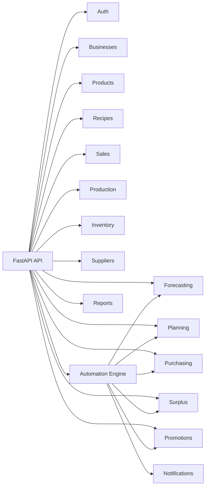

# C4 · Componentes

Muestra los módulos principales de la API y la orquestación. Fuente: sección 6.3 del documento maestro.

```mermaid
flowchart LR
API[FastAPI API]
AUTH[Auth]
BUSINESS[Businesses]
PRODUCTS[Products]
RECIPES[Recipes]
SALES[Sales]
PRODUCTION[Production]
INVENTORY[Inventory]
FORECAST[Forecasting]
PLANNING[Planning]
SUPPLIERS[Suppliers]
PURCHASE[Purchasing]
SURPLUS[Surplus]
PROMO[Promotions]
AUTO[Automation Engine]
REPORTS[Reports]
NOTIFY[Notifications]

API --> AUTH
API --> BUSINESS
API --> PRODUCTS
API --> RECIPES
API --> SALES
API --> PRODUCTION
API --> INVENTORY
API --> FORECAST
API --> PLANNING
API --> SUPPLIERS
API --> PURCHASE
API --> SURPLUS
API --> PROMO
API --> AUTO
API --> REPORTS

AUTO --> FORECAST
AUTO --> PLANNING
AUTO --> PURCHASE
AUTO --> SURPLUS
AUTO --> PROMO
AUTO --> NOTIFY
```
