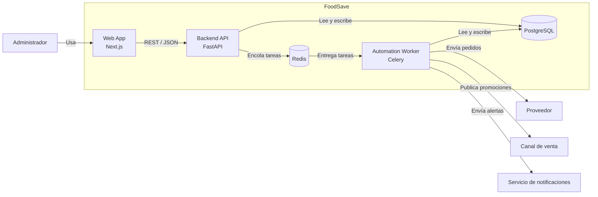

# C4 · Contenedores

Muestra la aplicación web, API, worker, PostgreSQL y Redis. Adaptado de la sección 6.2 del documento maestro como flujo Mermaid para facilitar su visualización.

```mermaid
flowchart LR
    admin[Administrador]
    provider[Proveedor]
    channel[Canal de venta]
    notification[Servicio de notificaciones]

    subgraph FoodSave
        frontend[Web App<br/>Next.js]
        api[Backend API<br/>FastAPI]
        worker[Automation Worker<br/>Celery]
        db[(PostgreSQL)]
        queue[(Redis)]
    end

    admin -->|Usa| frontend
    frontend -->|REST / JSON| api
    api -->|Lee y escribe| db
    api -->|Encola tareas| queue
    queue -->|Entrega tareas| worker
    worker -->|Lee y escribe| db
    worker -->|Envía pedidos| provider
    worker -->|Publica promociones| channel
    worker -->|Envía alertas| notification
```