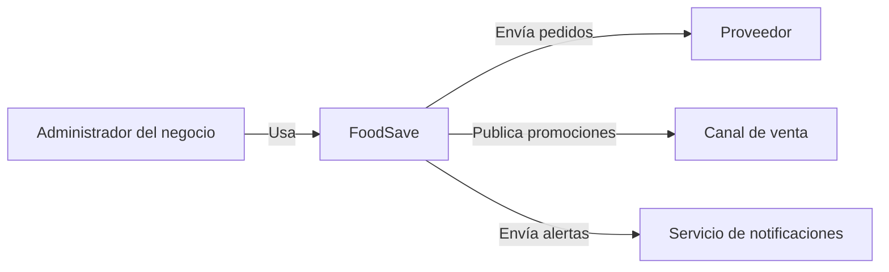

# C4 · Contexto

Muestra los actores y sistemas externos que interactúan con FoodSave. Adaptado de la sección 6.1 del documento maestro como flujo Mermaid para facilitar su visualización.

```mermaid
flowchart LR
    admin[Administrador del negocio] -->|Usa| foodsave[FoodSave]
    foodsave -->|Envía pedidos| provider[Proveedor]
    foodsave -->|Publica promociones| channel[Canal de venta]
    foodsave -->|Envía alertas| notification[Servicio de notificaciones]
```