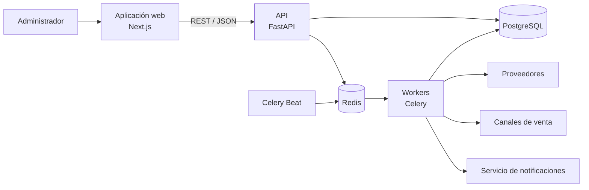

# Arquitectura general

FoodSave seguirá la propuesta del documento maestro: **monolito modular** con una aplicación web Next.js, una API FastAPI, PostgreSQL para persistencia y Celery con Redis para trabajos asíncronos. Celery Beat programará las automatizaciones periódicas.

La API organiza las reglas de negocio por dominio. Un módulo se comunica con otro a través de servicios o contratos definidos, sin acceder directamente a su repositorio. El motor de automatización orquesta las tareas, verifica sus resultados, reintenta los fallos y registra cada ejecución.

Las vistas [C4](c4/README.md) muestran el contexto, los contenedores y los componentes. El [ERD](../database/erd.md) describe las relaciones conceptuales de datos. Los [ADR](decisions/README.md) registran las decisiones técnicas iniciales.

Esta es una **arquitectura propuesta**, todavía no una implementación desplegada.
