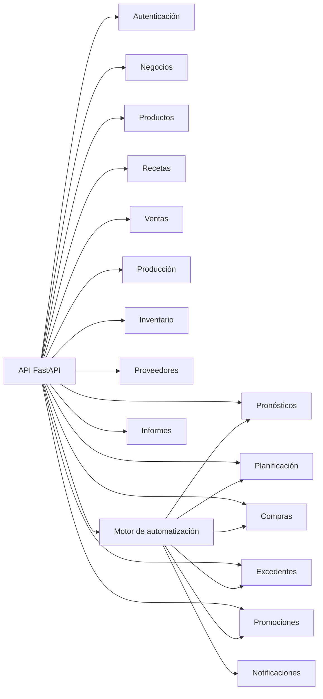

# C4 · Componentes

Muestra los módulos del servidor y la coordinación de las automatizaciones.

```mermaid
flowchart LR
    api[API FastAPI]
    autenticacion[Autenticación]
    negocios[Negocios]
    productos[Productos]
    recetas[Recetas]
    ventas[Ventas]
    produccion[Producción]
    inventario[Inventario]
    pronosticos[Pronósticos]
    planificacion[Planificación]
    proveedores[Proveedores]
    compras[Compras]
    excedentes[Excedentes]
    promociones[Promociones]
    automatizaciones[Motor de automatización]
    informes[Informes]
    notificaciones[Notificaciones]

    api --> autenticacion
    api --> negocios
    api --> productos
    api --> recetas
    api --> ventas
    api --> produccion
    api --> inventario
    api --> pronosticos
    api --> planificacion
    api --> proveedores
    api --> compras
    api --> excedentes
    api --> promociones
    api --> automatizaciones
    api --> informes

    automatizaciones --> pronosticos
    automatizaciones --> planificacion
    automatizaciones --> compras
    automatizaciones --> excedentes
    automatizaciones --> promociones
    automatizaciones --> notificaciones
```
