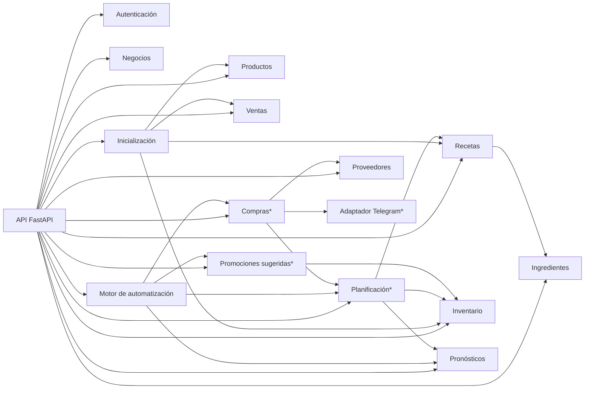

# C4 · Componentes

Módulos del servidor en la demo (`backend/app/modules/`) y quién orquesta las automatizaciones. Los módulos marcados con * aún no tienen código.

Producción, excedentes, desperdicio, notificaciones e informes son [visión futura](../../vision-futura.md).
