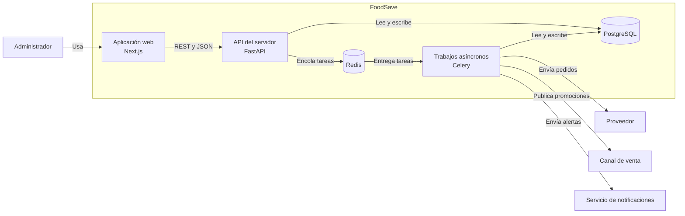

# C4 · Contenedores

Muestra la interfaz, la API, los trabajos asíncronos y los sistemas de almacenamiento.

```mermaid
flowchart LR
    administrador[Administrador]
    proveedor[Proveedor]
    canal[Canal de venta]
    avisos[Servicio de notificaciones]

    subgraph FoodSave
        interfaz[Aplicación web<br/>Next.js]
        api[API del servidor<br/>FastAPI]
        trabajador[Trabajos asíncronos<br/>Celery]
        base[(PostgreSQL)]
        cola[(Redis)]
    end

    administrador -->|Usa| interfaz
    interfaz -->|REST y JSON| api
    api -->|Lee y escribe| base
    api -->|Encola tareas| cola
    cola -->|Entrega tareas| trabajador
    trabajador -->|Lee y escribe| base
    trabajador -->|Envía pedidos| proveedor
    trabajador -->|Publica promociones| canal
    trabajador -->|Envía alertas| avisos
```
