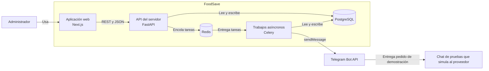

# C4 · Contenedores

Muestra los contenedores y el canal externo del prototipo. La publicación de descuentos y las alertas externas son posteriores.

```mermaid
flowchart LR
    administrador[Administrador]
    telegram[Telegram Bot API]
    proveedor[Chat de pruebas que simula al proveedor]

    subgraph FoodSave
        interfaz[Aplicación web<br/>Next.js]
        api[API del servidor<br/>FastAPI]
        trabajador[Trabajos asíncronos<br/>Celery]
        base[(PostgreSQL)]
        cola[(Redis)]
    end

    administrador -->|Usa| interfaz
    interfaz -->|REST y JSON| api
    api -->|Lee y escribe| base
    api -->|Encola tareas| cola
    cola -->|Entrega tareas| trabajador
    trabajador -->|Lee y escribe| base
    trabajador -->|sendMessage| telegram
    telegram -->|Entrega pedido de demostración| proveedor
```
