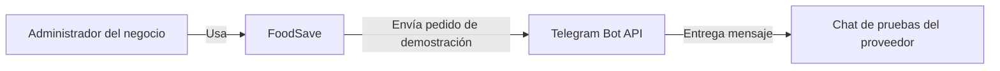

# C4 · Contexto

Muestra el alcance del prototipo. El destinatario de Telegram es un chat de pruebas que simula al proveedor; la publicación de promociones y las notificaciones externas quedan para después.

