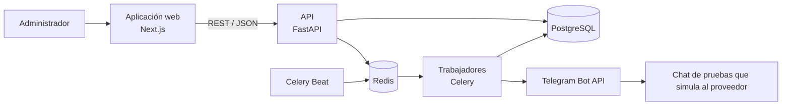

# Arquitectura general

FoodSave es un **monolito modular** con una aplicación web Next.js, una API FastAPI, PostgreSQL para persistencia y Celery con Redis para trabajos asíncronos. El [MVP local](decisiones/ADR-005-instalacion-local-mvp.md) usa una instalación y base por comercio, con una sola sucursal. Celery Beat revisa cada 30 segundos las programaciones guardadas y despacha las que vencieron ([programación](../automatizacion/programacion.md)).

La API organiza las reglas de negocio por dominio. Un módulo se comunica con otro a través de servicios o contratos definidos, sin acceder directamente a su repositorio. El motor de automatización orquesta las tareas, verifica sus resultados, reintenta los fallos y registra cada ejecución.

Las vistas [C4](c4/README.md) muestran el contexto, los contenedores y los componentes. El [diagrama entidad-relación](../base_de_datos/diagrama-entidad-relacion.md) describe las relaciones entre tablas del prototipo. Los [registros de decisiones](decisiones/README.md) documentan las elecciones técnicas iniciales.

No hay despliegue en servidor: cada comercio usa su instalación local con Docker Compose.
