# Diagrama entidad-relación

Este diagrama muestra relaciones conceptuales del MVP. Cada instalación tiene un único `NEGOCIO` como configuración local y una sola sucursal; por eso las tablas operativas no llevan `negocio_id`. Solo `NEGOCIO` y `USUARIO` existen en la migración inicial; las demás tablas se crearán tras revisar el [diccionario](diccionario-de-datos.md) con sus responsables.

```mermaid
erDiagram
    PRODUCTO ||--|| RECETA : tiene
    RECETA ||--o{ RECETA_INGREDIENTE : contiene
    INGREDIENTE ||--o{ RECETA_INGREDIENTE : se_usa_en

    PRODUCTO ||--o{ VENTA : tiene
    PRODUCTO ||--o{ REGISTRO_PRODUCCION : tiene
    PRODUCTO ||--o{ PRONOSTICO : tiene

    INGREDIENTE ||--|| INVENTARIO : tiene
    INGREDIENTE ||--o{ MOVIMIENTO_INVENTARIO : tiene
    PRODUCTO ||--|| EXISTENCIA_PRODUCTO : tiene

    PLAN_PRODUCCION ||--o{ ELEMENTO_PLAN_PRODUCCION : contiene
    PRODUCTO ||--o{ ELEMENTO_PLAN_PRODUCCION : se_planifica

    PLAN_PRODUCCION ||--o{ NECESIDAD_INGREDIENTE : genera
    INGREDIENTE ||--o{ NECESIDAD_INGREDIENTE : se_necesita

    PROVEEDOR ||--o{ PROVEEDOR_INGREDIENTE : ofrece
    INGREDIENTE ||--o{ PROVEEDOR_INGREDIENTE : es_suministrado

    PROVEEDOR ||--o{ PEDIDO_COMPRA : recibe
    PEDIDO_COMPRA ||--o{ ELEMENTO_PEDIDO_COMPRA : contiene
    PEDIDO_COMPRA ||--o{ ENVIO_PEDIDO : registra
    INGREDIENTE ||--o{ ELEMENTO_PEDIDO_COMPRA : se_solicita

    PRODUCTO ||--o{ DETECCION_EXCEDENTE : se_detecta
    DETECCION_EXCEDENTE ||--o{ PROMOCION : activa

    AUTOMATIZACION ||--o{ EJECUCION_AUTOMATIZACION : ejecuta
    EJECUCION_AUTOMATIZACION ||--o{ INTENTO_AUTOMATIZACION : reintenta
```

